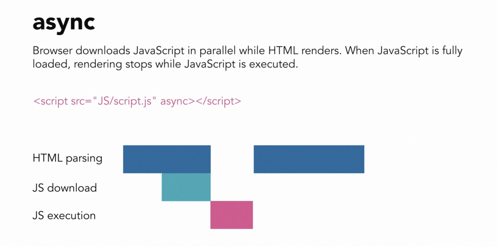
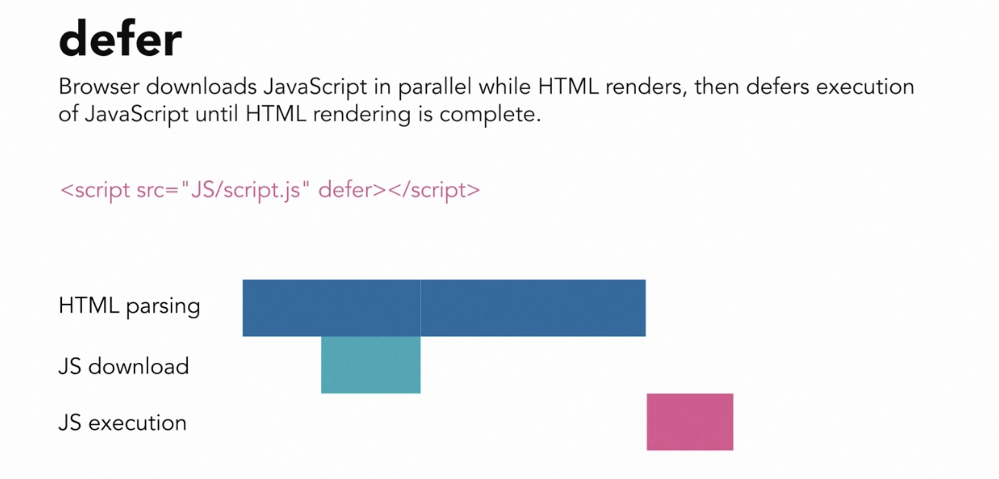

# Modern Javascript Loading Defer

## Objective

- To understand modern js loading

## Theory

- default behaviour


- async



- defer



## Begin

This HTML document has a simple structure with a `head` and a `body` element. The `head` contains metadata, such as the character set (`UTF-8`) and the viewport settings for responsive design. The `title` element sets the title of the webpage to "Module demo".

The main point of interest here is the `script` element, which includes the `defer` attribute:

```html
<script src="script.js" defer></script>
```

The `script` element with the `src` attribute is used to link an external JavaScript file (in this case, "script.js") to the HTML document. The `defer` attribute is a boolean attribute that, when present, specifies that the script should not be executed until the page has finished parsing.

Without the `defer` attribute, the browser would execute the script as soon as it encounters the `script` element while parsing the HTML document. This can lead to issues, such as accessing elements that have not been rendered yet or causing the rendering of the page to be blocked while the script is being downloaded and executed.

By adding the `defer` attribute, you instruct the browser to download the script file while continuing to parse the HTML, but not execute the script until the HTML parsing is complete. This can improve the performance of your webpage and help ensure that your script can access all the elements it needs in the DOM (Document Object Model).

In summary, the `defer` attribute in the `script` element tells the browser to delay the execution of the linked JavaScript file until the HTML document has been fully parsed, improving the performance and avoiding potential issues with accessing elements in the DOM.

- Loading in the browser


- However if you are not using the defer keyword. We get the following error as expected.

```html
    <script src="script.js"></script>
```


- Also the `backpack` object is available in console

