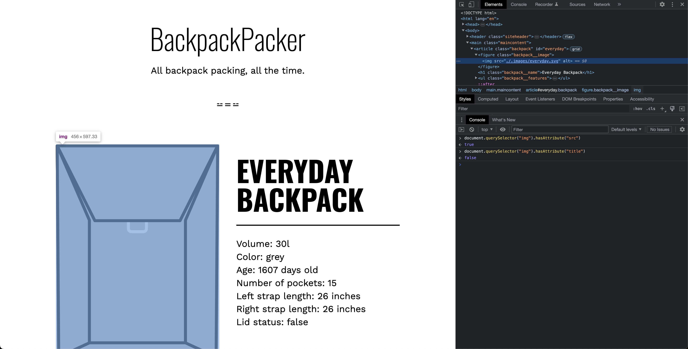
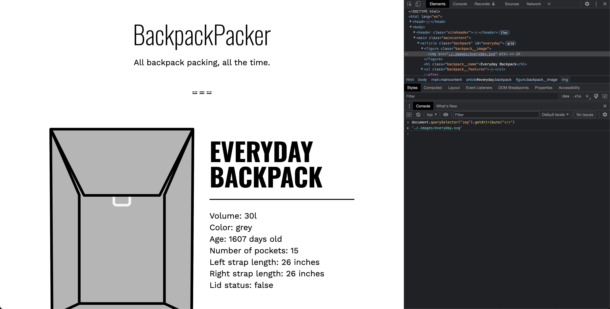
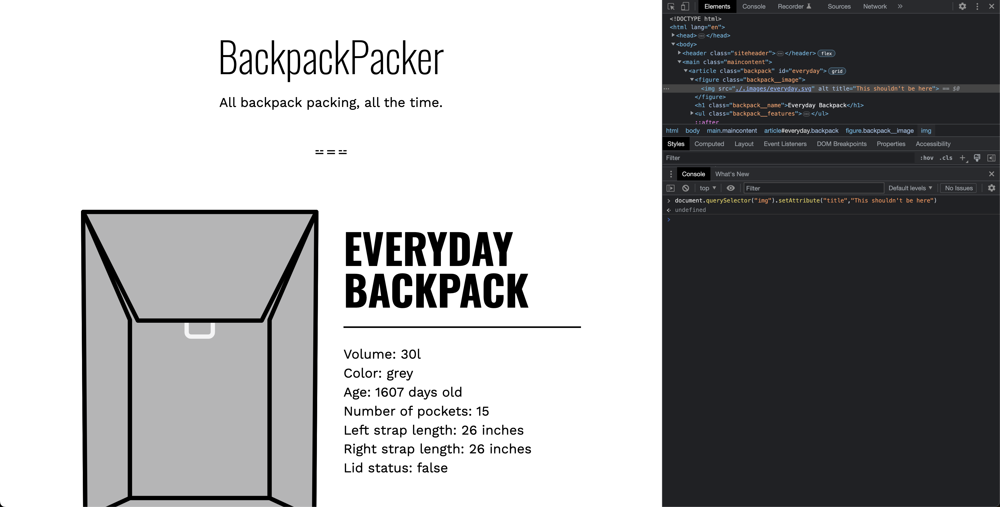

# Attributes Property

- [attributes](https://developer.mozilla.org/en-US/docs/Web/API/Element/attributes)

## Theory

In web development, elements in HTML have attributes, which provide additional information about the elements. These attributes can be standard (like `id`, `class`, `style`) or custom (like `data-*` attributes). 

The `attributes` property in the Element interface returns a live collection of all attribute nodes registered to the element. It's an instance of `NamedNodeMap`, not a plain array, so it has a specific set of methods for manipulation. 

For example, if you have an HTML element like this:

```html
<div id="myDiv" class="container" style="color:blue;"></div>
```

And you access its `attributes` property in JavaScript:

```javascript
var myDiv = document.getElementById("myDiv");
console.log(myDiv.attributes);
```

It will return a `NamedNodeMap` of the `div`'s attributes (`id`, `class`, `style`), along with their corresponding values (`"myDiv"`, `"container"`, `"color:blue;"`).

It's important to note that this is a "live" collection, meaning if attributes are added or removed from the element, the collection automatically updates to reflect the changes.

## Examples

- Let's get the attributes for `img` corresponding for `everyday.svg`


- Does this `img` has attribute `src` / `title` ?



- `img` has attribute `src`, what does it contain?



- `img` has attribute `alt`, what does it contain?


- Let's set the value of this `alt` attribute to `A drawing of a backpack`


- Let's add a `title` attribute which does not exist and give it a value as well `This shouldn't be here`



- Let's remove the newly added `title` attribute


