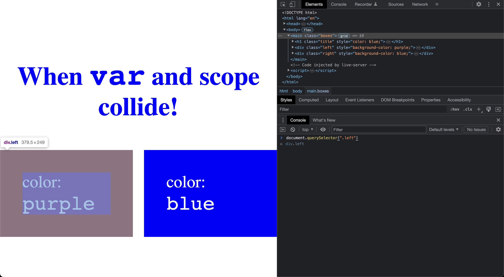
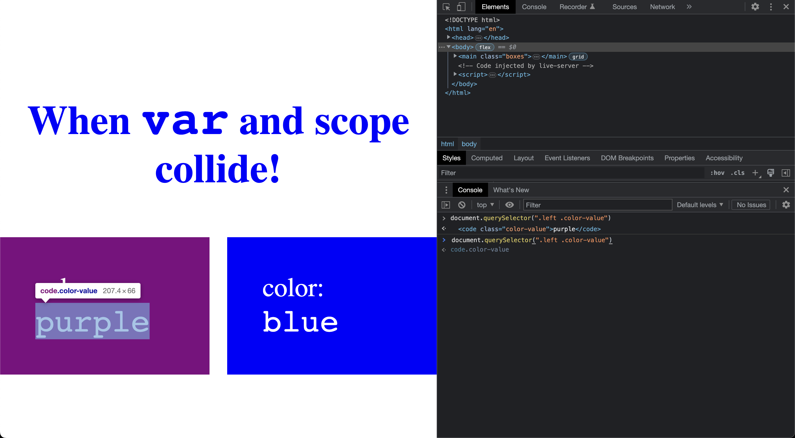
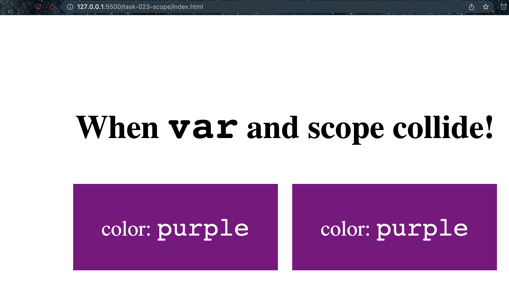
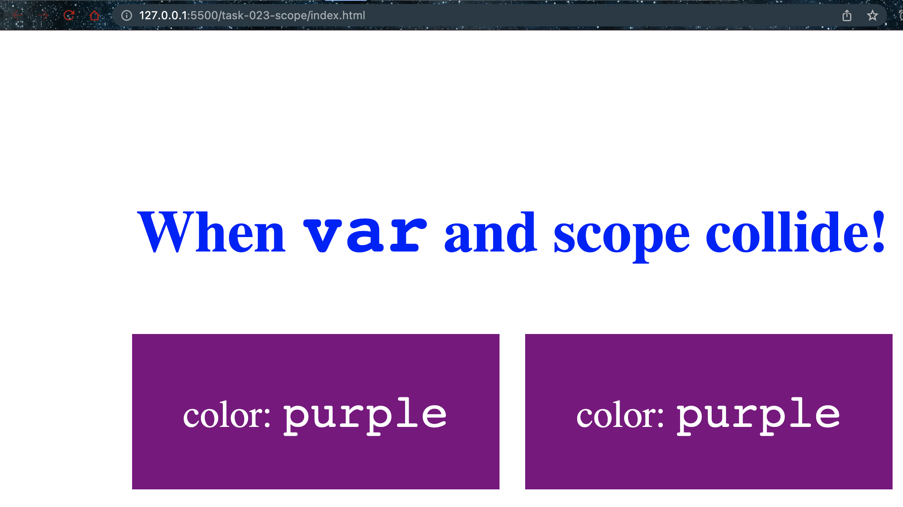

# Scope

- `document.querySelector(".left")` gives following



- `document.querySelector(".left .color-value")` gives following



- Similarly `document.querySelector(".right")` gives following


- Similarly `document.querySelector(".right .color-value").innerHTML` gives following


## Examples

### When function and headingcolor is commented

```javascript
var color = "purple";

document.querySelector(".left").style.backgroundColor = color;
document.querySelector(".left .color-value").innerHTML = color;

document.querySelector(".right").style.backgroundColor = color;
document.querySelector(".right .color-value").innerHTML = color;

// function headingColor() {
//   color = "blue";
//   document.querySelector(".title").style.color = color;
// }

// headingColor();
```



### When function and headingcolor is uncommented and function, function call are at the end

```javascript
var color = "purple";

document.querySelector(".left").style.backgroundColor = color;
document.querySelector(".left .color-value").innerHTML = color;

document.querySelector(".right").style.backgroundColor = color;
document.querySelector(".right .color-value").innerHTML = color;

function headingColor() {
  color = "blue";
  document.querySelector(".title").style.color = color;
}

headingColor();

```



### When function, function call are uncommented and placed in the middle

```javascript
var color = "purple";

document.querySelector(".left").style.backgroundColor = color;
document.querySelector(".left .color-value").innerHTML = color;

function headingColor() {
    color = "blue";
    document.querySelector(".title").style.color = color;
  }
  
headingColor();

document.querySelector(".right").style.backgroundColor = color;
document.querySelector(".right .color-value").innerHTML = color;
```


### When function, function call are uncommented. Function call placed in the middle.

```javascript
var color = "purple";

document.querySelector(".left").style.backgroundColor = color;
document.querySelector(".left .color-value").innerHTML = color;

headingColor();

document.querySelector(".right").style.backgroundColor = color;
document.querySelector(".right .color-value").innerHTML = color;

function headingColor() {
  color = "blue";
  document.querySelector(".title").style.color = color;
}
```


### Learning

- `var` is used to declare the variable `color`, which is globally scoped in all examples.
- The `querySelector` method is used to select specific HTML elements on the page based on the CSS selector passed as an argument.
- The `.style` property is used to change the CSS style of the selected element.
- The `.innerHTML` property is used to set the content of the selected element.
- When the `headingColor()` function is called, it changes the value of the `color` variable to "blue" and sets the color of the title to blue using the `querySelector` and `.style` properties.
- The position of the function and function call affects the order in which the code is executed, which in turn affects the order in which the elements are displayed on the page.

Overall, we can see that variables declared with `var` in JavaScript are globally scoped, which means they can be accessed and modified from anywhere in the code. This can lead to unintended consequences and bugs, especially in large and complex programs. It is recommended to use `let` or `const` instead of `var` to limit the scope of variables to specific blocks of code.