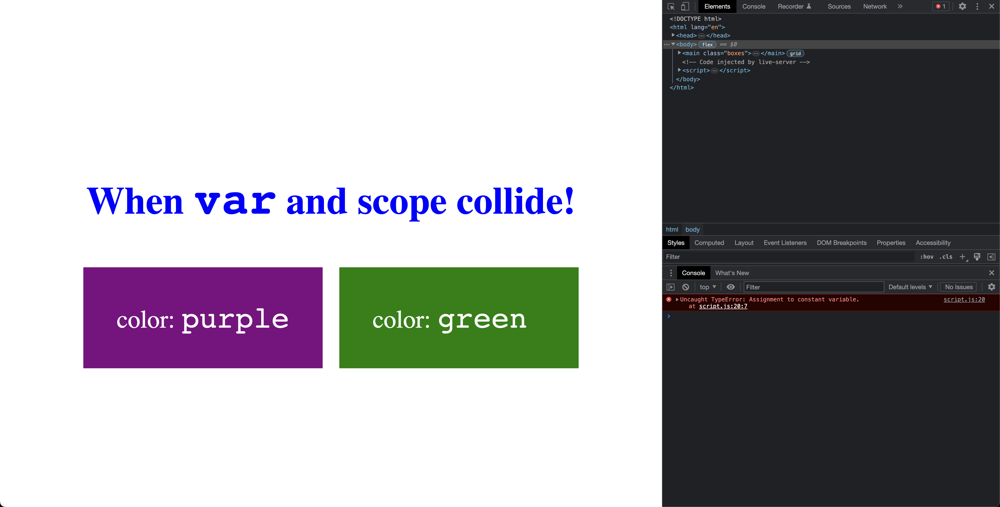

# Const

- [const](https://developer.mozilla.org/en-US/docs/Web/JavaScript/Reference/Statements/const)

## JS code

```javascript
const color = "purple";

document.querySelector(".left").style.backgroundColor = color;
document.querySelector(".left .color-value").innerHTML = color;


function headingColor() {
  let colorNew = "blue";
  document.querySelector(".title").style.color = colorNew;
}

headingColor();

// Should result in error because we cannot re-define the constant
color = "skyblue";

document.querySelector(".right").style.backgroundColor = color;
document.querySelector(".right .color-value").innerHTML = color;
```

## Explaination

The code demonstrates the use of the const keyword in JavaScript to declare a constant variable color with the value "purple". Constants are similar to variables, but their value cannot be changed after they are declared.

However, the code tries to reassign the value of the color constant to "skyblue", which should result in an error because constants cannot be reassigned after they are declared. When this line of code is executed, a runtime error will occur, which will prevent the subsequent lines of code that depend on the new value of color from executing as expected.

Overall, the const keyword in JavaScript is useful for declaring values that should not be changed during the execution of a program, and can help prevent unintended errors or bugs in the code.

## Example

- The error we get in the console and the output


