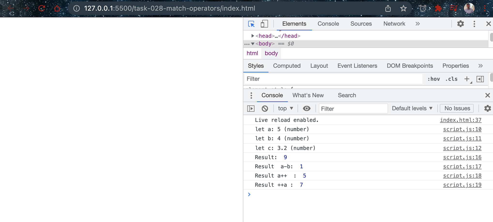

# Math Operators

- [Arithmetic Operators](https://developer.mozilla.org/en-US/docs/Web/JavaScript/Reference/Operators#Arithmetic_operators)
  
## Javascript code

```javascript
let a = 5;
let b = 4;
let c = 3.2;

console.log(`let a: ${a} (${typeof a})`);
console.log(`let b: ${b} (${typeof b})`);
console.log(`let c: ${c} (${typeof c})`);

let result = a + b;

console.log("Result: ", result);
console.log("Result  a-b: ", a-b);
console.log("Result a++  : ", a++);
console.log("Result ++a : ", ++a)
```

## Explaination

This JavaScript code demonstrates the use of arithmetic operators in the language:

The code initializes three variables: "a", "b", and "c". 

The variable "a" is assigned a numeric value of 5 using the assignment operator (=). The variable "b" is assigned a numeric value of 4. The variable "c" is assigned a floating-point number value of 3.2. 

The code then uses console.log() to print the values of the three variables along with their respective data types using the template literals. 

The code then performs several arithmetic operations using the following operators:

1. Addition operator (+): The code adds the values of "a" and "b" using the addition operator and assigns the result to the variable "result". The result of the addition operation is printed to the console using console.log().

2. Subtraction operator (-): The code subtracts the value of "b" from "a" using the subtraction operator and prints the result to the console using console.log().

3. Postfix increment operator (a++): The code uses the postfix increment operator to increment the value of "a" by 1 after it has been used in an expression. The original value of "a" is printed to the console using console.log().

4. Prefix increment operator (++a): The code uses the prefix increment operator to increment the value of "a" by 1 before it is used in an expression. The new value of "a" is printed to the console using console.log().

In conclusion, the code shows how to use arithmetic operators in JavaScript to perform various mathematical operations on variables.

## Examples

- Math operators


