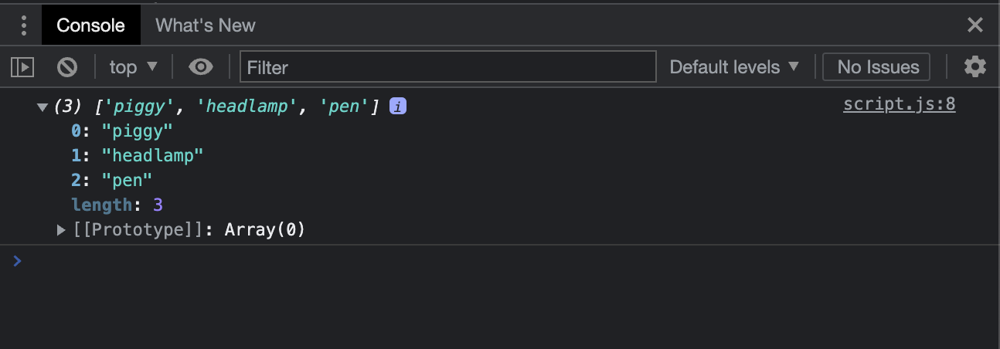
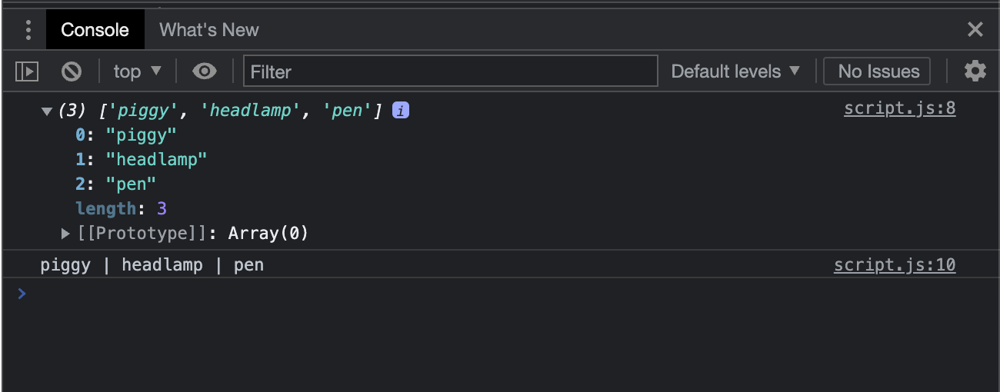
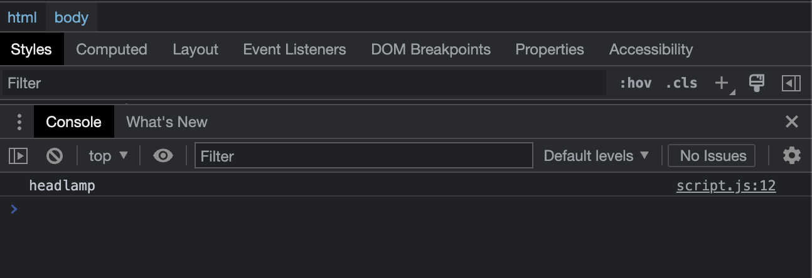

# Array methods

- [Array methods](https://developer.mozilla.org/en-US/docs/Web/JavaScript/Reference/Global_Objects/Array#Instance_methods)

## Javascript Code and Screenshots

- Declare, initialize and print array

```javascript
let backpackContents = ["piggy", "headlamp", "pen"];

console.log(backpackContents);
```



- `.join()` method

```javascript
let backpackContents = ["piggy", "headlamp", "pen"];

console.log(backpackContents);

console.log(backpackContents.join(" | "));
```



- `push()` and `unshift()` methods

```javascript
let backpackContents = ["piggy", "headlamp", "pen"];

backpackContents.push("added at the end");

backpackContents.unshift("added to the begining");

console.log(backpackContents.join(" | "));
```


- `shift()` and `pop()` methods

```javascript
let backpackContents = ["piggy", "headlamp", "pen"];

backpackContents.pop();

backpackContents.shift();

console.log(backpackContents.join(" | "));
```



- `forEach()` and `find()` methods

```javascript
let backpackContents = ["piggy", "headlamp", "pen"];

console.log(backpackContents.join(" | "));

backpackContents.forEach(
    function (item) {
        item = `<li> ${item} </li>`;
        console.log(item)
    }
);

console.log(backpackContents);

let longItems = backpackContents.find(
    function (item) {
        if (item.length > 5) {
            return item;
        }
    }
);

console.log("long items", longItems);

console.log(backpackContents);
```

This JavaScript code demonstrates the use of some array methods in the language:

The code initializes an array "backpackContents" with three string values: "piggy", "headlamp", and "pen".

The code then uses console.log() to output the contents of the array as a string joined by a separator "|" using the join() method. This will output "piggy | headlamp | pen" to the console.

The code then uses the forEach() method to iterate through each element of the array and perform an action on it. The action is defined as a function that takes the current element as a parameter, wraps it in an HTML \<li\> tag, and then logs it to the console. The forEach() method does not modify the original array, so when the original array is logged to the console, it outputs the original contents of the array as an array of strings.

The code then uses the find() method to search for the first element in the array that has a length greater than 5. The find() method returns the first element that matches the search criteria, or undefined if no element is found. In this case, since the second element "headlamp" has a length greater than 5, the find() method returns "headlamp". This output is logged to the console as "long items headlamp".

Finally, the code logs the original contents of the array again to the console, which will output the original array of strings since none of the methods above modify the original array.

In conclusion, this code demonstrates how to use various array methods in JavaScript to manipulate and search through the contents of an array. The forEach() method is used to perform an action on each element of the array, the join() method is used to join the contents of an array into a string using a separator, and the find() method is used to search for an element in an array that matches a certain criterion.


