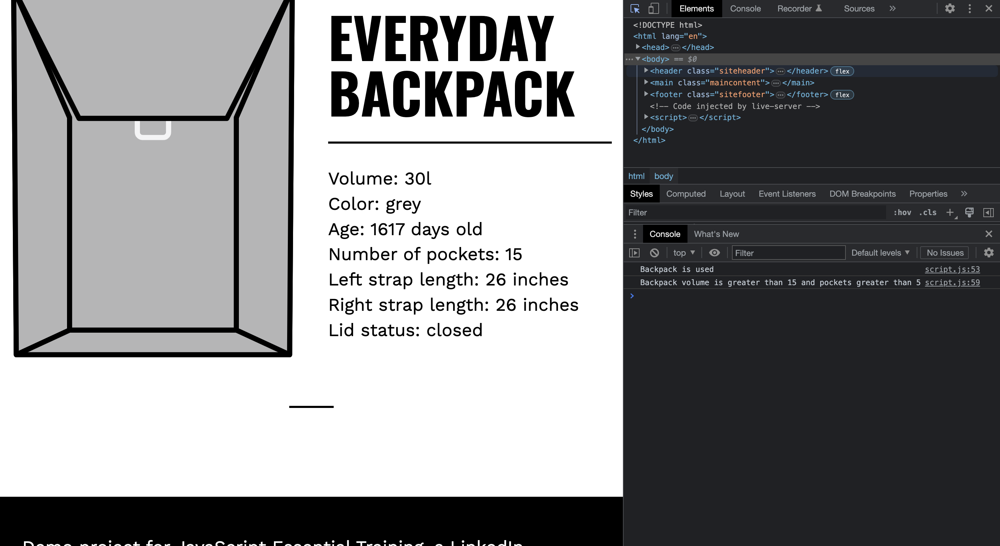

# Logical Operators

## Javascript Code

```javascript
if (everydayPack.backpackAge() >= 30) {
  console.log("Backpack is used");
} else {
  console.log("Backpack is new");
}

if (everydayPack.volume > 15 && everydayPack.pocketNum > 5) {
  console.log("Backpack volume is greater than 15 and pockets greater than 5");
} else {
  console.log("Else part")
}
```

## Explaination

In JavaScript, logical operators are used to combine or evaluate multiple conditions. The code snippet provided demonstrates the usage of logical operators in conditional statements.

1. The `>=` operator is the greater than or equal to operator. In the first `if` statement, it checks if the result of `everydayPack.backpackAge()` is greater than or equal to 30. If the condition is true, it executes the code block inside the `if` statement and logs "Backpack is used" to the console. Otherwise, if the condition is false, it executes the code block inside the `else` statement and logs "Backpack is new" to the console.

2. The `>` operator is the greater than operator, and the `&&` operator is the logical AND operator. In the second `if` statement, it checks if both conditions are true: `everydayPack.volume > 15` and `everydayPack.pocketNum > 5`. If both conditions are true, it executes the code block inside the `if` statement and logs "Backpack volume is greater than 15 and pockets greater than 5" to the console. Otherwise, if any of the conditions is false, it executes the code block inside the `else` statement and logs "Else part" to the console.

Logical operators allow you to perform more complex evaluations and make decisions based on multiple conditions. They provide flexibility in controlling the flow of your code based on various criteria.

## Screenshots


