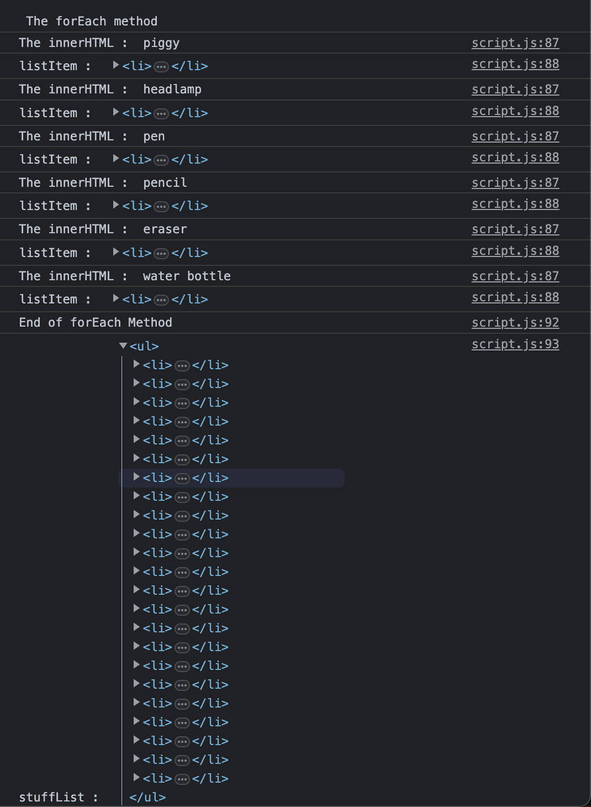

# Looping through elements

## Screenshots

- First let's declare and print the objects

```javascript
const stuff = ["piggy", "headlamp", "pen", "pencil", "eraser", "water bottle"];

const nestedObjects = {
  item01: {
    name: "piggy",
    type: "toy",
    weight: 30,
  },
  item02: {
    name: "headlamp",
    type: "equipment",
    weight: 120,
  },
  item03: {
    name: "pen",
    type: "tool",
    weight: 30,
  },
  item04: {
    name: "pencil",
    type: "tool",
    weight: 30,
  },
  item05: {
    name: "eraser",
    type: "tool",
    weight: 40,
  },
  item03: {
    name: "water bottle",
    type: "equipment",
    weight: 1300,
  },
};

const article = document.querySelector("article");
let stuffList = document.createElement("ul");

console.log("Stuff : ", stuff);
console.log("Nested Object : ", nestedObjects);
```


- Adding the first for loop 

```javascript
for (let i = 0; i < stuff.length; i++) {
  let listItem = document.createElement("li");
  listItem.innerHTML = stuff[i];
  console.log("Inner HTML : ", listItem.innerHTML)
  console.log("Item : ", listItem)
  stuffList.append(listItem);
}

console.log("stuffList : ", stuffList);
```


> Note: Output is updated with the elements that were added after the script as well. That's why you have more elements in stuffList. Javascript shows the current state of the stuffList here.

- Using the next type of for loop now

```javascript
console.log("\n\nUsing for loop of type: for (const item of stuff) {} ")
  let listItem = document.createElement("li");
  listItem.innerHTML = item;
  console.log("Inner HTML", listItem.innerHTML)
  console.log("Item ", listItem)
  stuffList.append(listItem);
}

console.log("\n\n For loop completed");
console.log("stuffList : ", stuffList);
```


- let's add the `forEach` method

```javascript
console.log("\n\n The forEach method");
stuff.forEach((item) => {
  let listItem = document.createElement("li");
  listItem.innerHTML = item;
  console.log("The innerHTML : ", listItem.innerHTML);
  console.log("listItem : ", listItem);
  stuffList.append(listItem);
});

console.log("End of forEach Method");
console.log("stuffList : ", stuffList);
```



- adding the final form of for loop

```javascript
console.log("\n\nUsing for (const singleObject in nestedObjects)");
console.log("nestedObjects: ", nestedObjects);
for (const singleObject in nestedObjects) {
  let listItem = document.createElement("li");
  listItem.innerHTML = `Weight: ${nestedObjects[singleObject].weight}`;
  console.log("singleObject : ", singleObject);
  console.log(`typeOf(${singleObject})`, typeof (singleObject));
  stuffList.append(listItem);
}

console.log(`nestedObjects["item01"].name : `, nestedObjects["item01"].name);
console.log(`nestedObjects["item01"].type : `, nestedObjects["item01"].type);
console.log(`nestedObjects["item01"].weight : `, nestedObjects["item01"].weight);

console.log("stuffList : ", stuffList);
article.append(stuffList);
```


