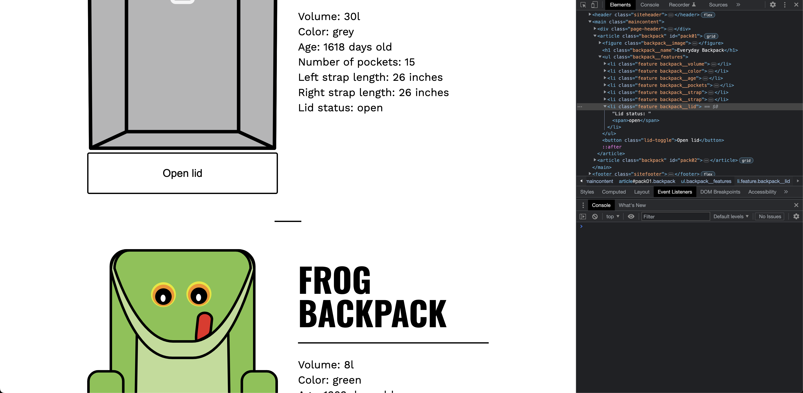

# Event listner

## Javascript Code

```javascript
  const button = backpackArticle.querySelector(".lid-toggle")
  const status = backpackArticle.querySelector(".backpack__lid span")

  button.addEventListener("click", (event) => {
    console.log(event)
    status.innerText === "open" ? status.innerText = "closed" : status.innerText = "open"
  })

  return backpackArticle;
```

## Explaination

The provided code demonstrates event listeners being used to handle the "click" event on a button element with the class "lid-toggle". Here's an explanation of the event listener:

1. The code first selects the button element using `backpackArticle.querySelector(".lid-toggle")` and the span element with the class "backpack__lid span" using `backpackArticle.querySelector(".backpack__lid span")`.

2. The event listener is added to the button element using `button.addEventListener("click", (event) => { ... })`. It listens for the "click" event on the button.

3. When the button is clicked, the callback function is triggered. The function first logs the `event` object to the console.

4. The callback function checks the current text content of the `status` element (the span inside the backpack article) using `status.innerText`. If the text content is "open", it updates it to "closed" using `status.innerText = "closed"`. Otherwise, if the text content is "closed", it updates it to "open" using `status.innerText = "open"`.

In summary, the event listener is used to toggle the status of the backpack's lid. When the button is clicked, the status (text content) of the corresponding span element is toggled between "open" and "closed".

## Screenshots

- Before clicking the "Open lid" button



- After clicking the "Open lid" button


