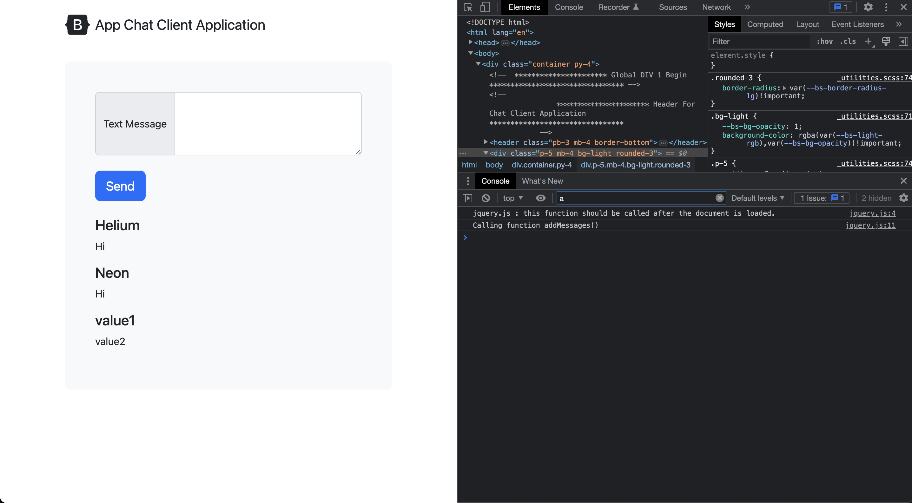
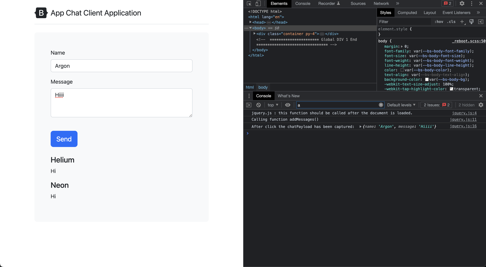
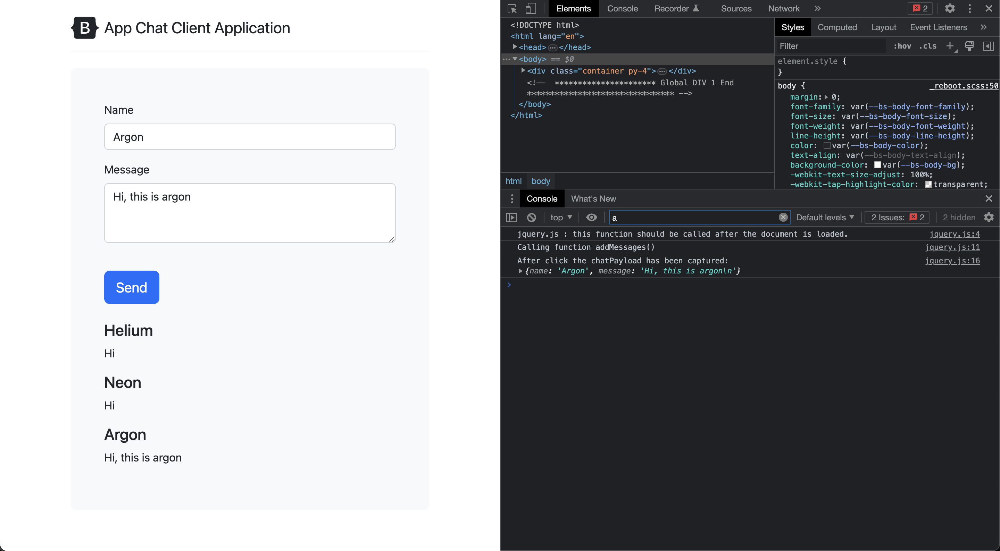
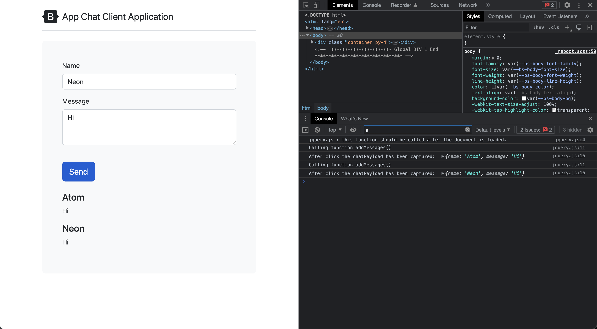

# Create Post Message Service

## Screenshots and Explaination

- Adding post request method
  
```javascript
app.post('/messages', (req, res) => {
    console.log("This is post request");
    console.log("Req body: ", req.body);
    res.sendStatus(200);
})
```

- Running the server and hitting post

```bash
# Terminal 1
$ curl -X POST -H "Content-Type: application/json" -d '{"key1":"value1", "key2":"value2"}' http://localhost:3000/messages
OK

# Terminal 2: Where server is running
server is listening on port 3000
This is post request
Req body:  undefined
```

- So we need to add body parser

```bash
$ npm install -s body-parser
.
```

- Now giving the same request again 

```bash
# Terminal 1
$ curl -X POST -H "Content-Type: application/json" -d '{"key1":"value1", "key2":"value2"}' http://localhost:3000/messages
OK

# Terminal 2: Where server is running
server is listening on port 3000
This is post request
Req body:  { key1: 'value1', key2: 'value2' }
```

- Now checking the things in browser

```bash
# Terminal 1
curl -X POST -H "Content-Type: application/json" -d '{"name":"value1", "message":"value2"}' http://localhost:3000/messages
OK
```

- After you click on `send`



- Start capturing the user input in console.log



- Tring to call `/messages` post endpoint on the server, we are unable to parse the request data.

```bash
# Server
server is listening on port 3000
This is post request
Req body:  {}
```


- After using bodyParser.urlencoded()

```bash
# Server
server is listening on port 3000
This is post request
Req body:  [Object: null prototype] {
  name: 'Argon',
  message: 'Hi, this is argon\n'
}
```



- Fixing the redundant printing of message by clearing `#message` before each call


