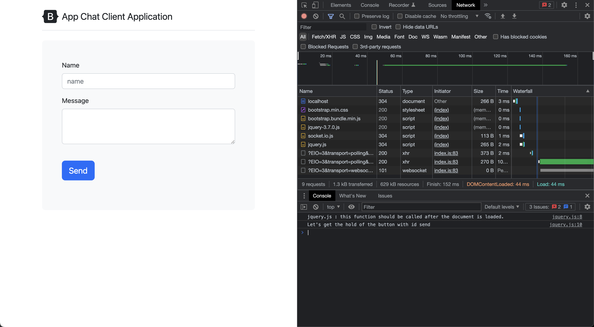

# Connect to Socket.io from browser app

- Install dependency `socket.io`

```bash
$ npm install -s socket.io  
.
```

## Code

```javascript
var http = require('http').Server(app)
var io = require('socket.io')(http)
```

1. `var http = require('http').Server(app)`: Here you are importing the HTTP module from Node.js and creating a new HTTP server that uses the Express application instance (`app`).

2. `var io = require('socket.io')(http)`: This line requires the Socket.IO library and immediately initializes it with the HTTP server instance (`http`). This allows you to use Socket.IO for real-time, bidirectional, and event-based communication between the server and the client.

```html
        <!-- Socket.io -->
        <script src="/socket.io/socket.io.js"></script>
```

The `<script>` tag you're seeing is a standard way of including JavaScript files in an HTML document. In your case, you're including the Socket.IO client-side library in your web page.

The `src` attribute of the `<script>` tag is the path to the JavaScript file that should be included. When the browser parses this `<script>` tag, it sends a GET request to the server to retrieve the file located at `/socket.io/socket.io.js`.

When you initialize a Socket.IO server instance as in your previous example (`var io = require('socket.io')(http)`), one of the things that Socket.IO does in the background is set up a route at `/socket.io/socket.io.js` to serve the client-side library. This route is accessible from your HTML file and returns the `socket.io.js` file needed to establish and work with the WebSocket connections on the client side.

So when you write `<script src="/socket.io/socket.io.js"></script>` in your HTML file, the browser knows to send a GET request to your server at the `/socket.io/socket.io.js` path, and your Socket.IO-enabled server knows to respond with the appropriate `socket.io.js` file. The browser then executes this file, providing your client-side JavaScript code access to the Socket.IO client-side API.

This way, the browser and server can communicate using WebSockets, which allow for real-time, bidirectional communication.

- After initialization, you can see the file is loaded


```javascript
var socket = io()
```

The line `var socket = io()` in your client-side JavaScript is used to establish a connection to your Socket.IO server. `io()` is a function provided by the Socket.IO library (which you included in your HTML with `<script src="/socket.io/socket.io.js"></script>`) that, when called, will attempt to connect to a Socket.IO server at the current location (i.e., the same location where the HTML file is served from).

The `socket` variable represents the connection to the server. With this `socket` object, you can now send and receive messages using the Socket.IO protocol.

```javascript
var http = require('http').Server(app)
var io = require('socket.io')(http)

io.on('connection', (socket) => {
    console.log("A user is connected");
})
```

On the server side, `var io = require('socket.io')(http)` initializes a new Socket.IO server and attaches it to an existing HTTP server (`http`). The `io.on('connection', (socket) => {...})` listens for any new connections to the Socket.IO server.

When a client successfully connects (as is done by `var socket = io()` on the client side), the server triggers the `'connection'` event. The callback function attached to this event is called with the `socket` object representing the new connection.

`console.log("A user is connected")` just logs to the server's console that a user has connected.

In the callback, you typically set up more listeners for events that you expect to receive from this client. For example, you might listen for a 'message' event if you expect the client to send chat messages.

Overall, these lines of code set up real-time, bidirectional communication between your server and any clients that connect to it using Socket.IO.



and you get the following on server side

```bash
server is listening on port 3000
A user is connected
A user is connected
```
