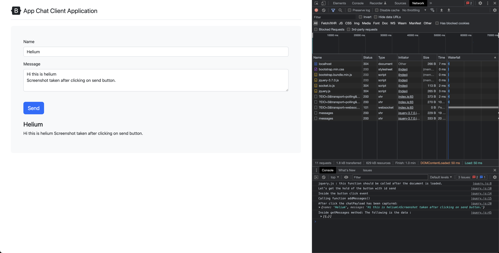
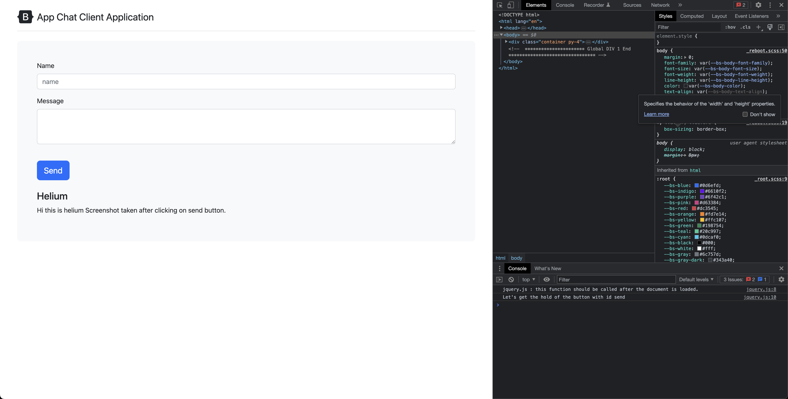
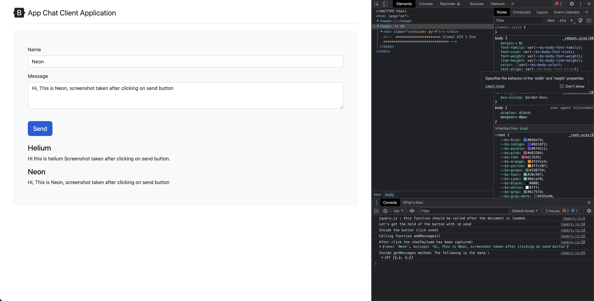
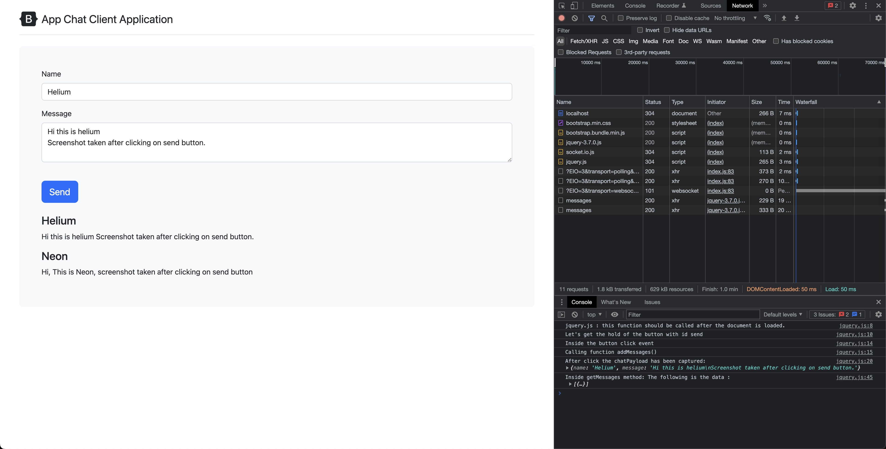
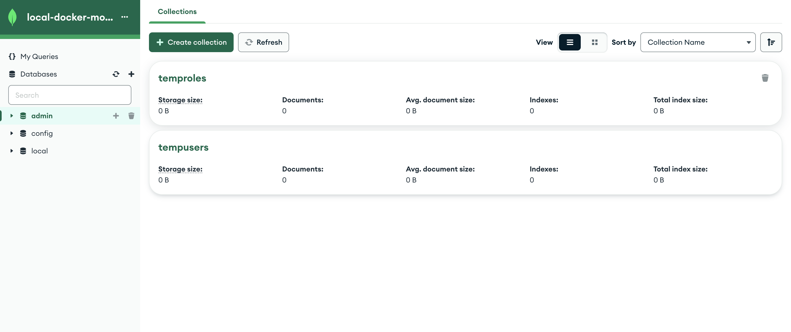
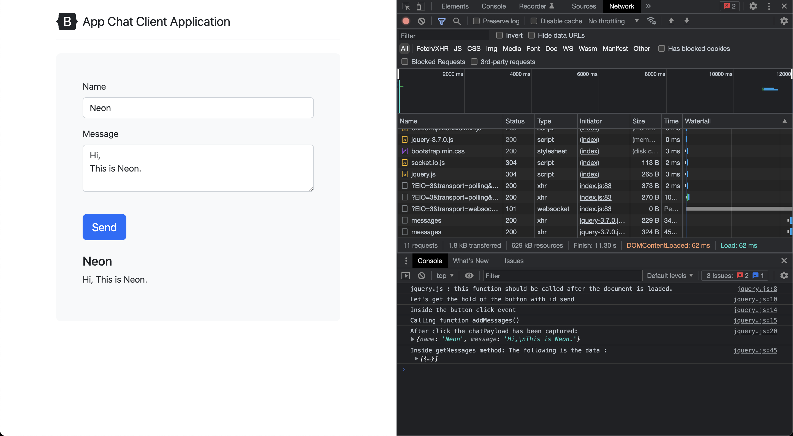

# Create your socket event and Saving Data to MongoDB

## Code

```javascript
// Emit `message` on post
app.post('/messages', (req, res) => {
    console.log("This is post request");
    console.log("Req body: ", req.body);
    messages.push(req.body);
    io.emit('message', req.body);
    res.sendStatus(200);
})

// On the event trigger addMessages function
socket.on('message', addMessages)
```

## Open Two Tabs

### Tab One (after clicking on send button) -- Helium



### Tab Two (State before clicking on send) -- Neon



### Tab Two (State after clicking on send) -- Neon



### Tab One (before clicking on send) -- Helium



```bash
## Server Side
$ nodemon server.js
[nodemon] 2.0.22
[nodemon] to restart at any time, enter `rs`
[nodemon] watching path(s): *.*
[nodemon] watching extensions: js,mjs,json
[nodemon] starting `node server.js`
server is listening on port 3000
A user is connected
A user is connected

```

## Saving Data to MongoDB

### Connecting to MongoDB

```bash
$ npm install mongoose    
.
```

- Start docker database

```bash
# use : -d       if necessary
docker run --rm  --name mongo-on-docker  -p 27888:27017 -e MONGO_INITDB_ROOT_USERNAME=mongoadmin -e MONGO_INITDB_ROOT_PASSWORD=secret mongo
```

- Add the relevent code to connect to the databasee

```javascript
var mongoose = require('mongoose')
// https://mongoosejs.com/docs/connections.html
mongoose.connect(dbUrl, {
    serverSelectionTimeoutMS: 5000
}).catch((err) => {
    console.log("Error while connecting to the database : ", err.reason)
}
);
```

The provided code snippet demonstrates how to use the Mongoose library in Node.js to connect to a MongoDB database. Let's break down the code and explain each part:

1. Importing the Mongoose module:

```javascript
var mongoose = require('mongoose');
```

This line imports the Mongoose module, making its functionalities available in the current file. The `mongoose` variable can be used to interact with the MongoDB database.

2. Connecting to the MongoDB database:

```javascript
mongoose.connect(dbUrl, {
    serverSelectionTimeoutMS: 5000
}).catch((err) => {
    console.log("Error while connecting to the database: ", err.reason);
});
```

Here, `dbUrl` represents the connection string or URL for your MongoDB database. You should replace it with the appropriate URL for your database.

The `mongoose.connect()` method is used to establish a connection to the MongoDB database. It takes two parameters: the `dbUrl` and an options object. In this case, the options object includes the `serverSelectionTimeoutMS` property set to `5000` (5 seconds). This property determines the maximum time to wait for the MongoDB server to be selected or connected.

If an error occurs during the connection process, the `.catch()` method is called, and the error is logged to the console using `console.log()`.

By using this code snippet, you can connect your Node.js application to a MongoDB database using Mongoose and handle any connection errors that may occur.

The is the output of the server side

```bash
[nodemon] starting `node server.js`
Database is connected.
server is listening on port 3000
A user is connected
A user is connected
```

### Saving data to mongodb

- [MongoDB compass](https://www.mongodb.com/try/download/compass)

The provided code snippet demonstrates the usage of Mongoose models and the `save()` method to save data to a MongoDB database. Let's break it down and explain each part:

1. Defining the Mongoose model:

```javascript
var messageModel = mongoose.model('message', {
    name: String,
    message: String,
});
```

In this code, a Mongoose model named `messageModel` is created using the `mongoose.model()` function. The model represents a collection in the MongoDB database and defines the schema for the documents in that collection. In this case, the schema specifies that each document should have a `name` property of type String and a `message` property of type String.

2. Handling the POST request:


```javascript
app.post('/messages', (req, res) => {
    var messageModelObject = new messageModel(req.body);

    messageModelObject.save()
        .then(() => {
            console.log("Message has been saved successfully in the database");
            console.log("This is a post request");
            console.log("Req body: ", req.body);
            messages.push(req.body);
            io.emit('message', req.body);
            res.sendStatus(200);
        })
        .catch((err) => {
            console.log("There was an error saving the msg object to the database");
            console.log("Sending 500 status code");
            res.sendStatus(500);
        });
});
```

This code handles a POST request to the `/messages` endpoint. It creates a new instance of the `messageModel` using the request body (`req.body`) as the data. The `save()` method is then called on the `messageModelObject` to save the data to the MongoDB database.

If the save operation is successful, the `.then()` block is executed, logging a success message to the console and performing additional actions such as pushing the message data to an array (`messages`), emitting a `message` event through Socket.io, and sending a 200 status code as the response.

If there is an error during the save operation, the `.catch()` block is executed, logging an error message to the console and sending a 500 status code as the response.

This code snippet demonstrates how to create a Mongoose model, save data to the database using the `save()` method, and handle the results of the save operation. It is commonly used in Express.js applications to handle the persistence of data submitted through HTTP requests.

The following is the database state before saving any messages



Sending a message


Database state after message is saved


Server logs when the messages is saved

```bash
nodemon] starting `node server.js`
Database is connected.
server is listening on port 3000
A user is connected
A user is connected
A user is connected
Message has been saved successfully in the database
This is a post request
Req body:  [Object: null prototype] {
  name: 'Helium',
  message: 'Hi,\nThis is mongodb test'
}
```

Let's try stopping the database before we click on Send button

- Press CNTR+C where the database is running

- You get `INTERNAL SERVER ERROR` as expected


- Server logs

```bash
Message has been saved successfully in the database
This is a post request
Req body:  [Object: null prototype] { name: 'Helium', message: 'Hiii' }
There was an error saving the msg object to the database
Sending 500 status code

```

### Finding messages in mongodb

Let's break down the code and explain each part:

```javascript
app.get('/messages', (req, res) => {
    messageModel.find({})
        .then((messages) => {
            console.log("Successfully found all the documents as per query");
            res.send(messages);
        })
        .catch((err) => {
            console.log("Error finding the documents in the database:", err);
            res.sendStatus(500);
        });
});
```

This code snippet handles a GET request to the `/messages` endpoint.

1. `app.get('/messages', (req, res) => { ... })`: This sets up a route handler for the GET request to the `/messages` endpoint.

2. `messageModel.find({})`: This is a Mongoose query that searches for all documents in the `messageModel` collection. The `{}` parameter is an empty object, indicating that there are no specific criteria for the search and all documents should be returned.

3. `.then((messages) => { ... })`: If the `find()` operation is successful, the `.then()` block is executed, receiving the retrieved `messages` array as a parameter.

4. `console.log("Successfully found all the documents as per query")`: This line logs a success message to the console indicating that all documents were successfully found as per the query.

5. `res.send(messages)`: The `messages` array, containing the retrieved documents, is sent as the response using the `res.send()` method. This sends the array of documents back to the client making the GET request.

6. `.catch((err) => { ... })`: If there is an error during the `find()` operation, the `.catch()` block is executed, receiving the `err` parameter.

7. `console.log("Error finding the documents in the database:", err)`: This line logs an error message, along with the specific error that occurred during the find operation, to the console.

8. `res.sendStatus(500)`: A 500 status code is sent as the response using the `res.sendStatus()` method, indicating a server error occurred during the database query.

By using this code snippet, you can handle a GET request to the `/messages` endpoint, retrieve all documents from the `messageModel` collection, and send them back as the response. If any errors occur during the retrieval process, an error message and a 500 status code are returned.

- Posting first message



- Server logs

```bash
Database is connected.
server is listening on port 3000
A user is connected
Message has been saved successfully in the database
This is a post request
Req body:  [Object: null prototype] {
  name: 'Neon',
  message: 'Hi,\nThis is Neon.'
}
Successfully found all the documents as per mongo query
Messages :  [
  {
    _id: new ObjectId("6468ea79aac9fa190e011a99"),
    name: 'Neon',
    message: 'Hi,\nThis is Neon.',
    __v: 0
  }
]
```

- Stop the server and restart

```bash
  {
    _id: new ObjectId("6468ea79aac9fa190e011a99"),
    name: 'Neon',
    message: 'Hi,\nThis is Neon.',
    __v: 0
  }
]
^C


[nodemon] 2.0.22
[nodemon] to restart at any time, enter `rs`
[nodemon] watching path(s): *.*
[nodemon] watching extensions: js,mjs,json
[nodemon] starting `node server.js`
Database is connected.
server is listening on port 3000
A user is connected
A user is connected
A user is connected
A user is connected
Message has been saved successfully in the database
This is a post request
Req body:  [Object: null prototype] {
  name: 'Helium',
  message: 'I should see Neon msg as well.'
}
Successfully found all the documents as per mongo query
Messages :  [
  {
    _id: new ObjectId("6468ea79aac9fa190e011a99"),
    name: 'Neon',
    message: 'Hi,\nThis is Neon.',
    __v: 0
  },
  {
    _id: new ObjectId("6468eb34aac3c694bd6f68b4"),
    name: 'Helium',
    message: 'I should see Neon msg as well.',
    __v: 0
  }
]
```

- Now post another message, we should see the previous message as well


