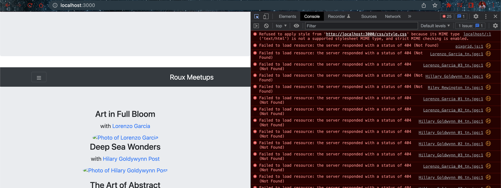

# Serving HTML Pages and Static Content

- Create a folder named `static` in the root of the project
- Add content to `static` folder
  - `images` folder
  - `css` folder
  - `js` folder
  - `index.html` file
  - other `.html` files

- Add following to `server.js`

```js
const path = require('path');
app.get('/', (request, response) => {
    response.sendFile(path.join(__dirname, './static/index.html'));
}
);
```

```bash
node server.js 
Server is listening on port 3000 Ready to accept requests!
```



- the js and css are not loaded because the middleware is not configured to serve static content

```js
app.use(express.static(path.join(__dirname, './static')));
```

- Home page


- /speakers


## Explaination

This code snippet is a simple Node.js server application using Express.js, a fast and minimalist web application framework for Node.js.

Here's a line-by-line explanation:

```javascript
const express = require('express');
```

This line imports the Express.js module using Node's `require` function.

```javascript
const path = require('path');
```

The `path` module provides utilities for working with file and directory paths. It's built into Node.js, so no need to install it separately.

```javascript
const app = express();
```

This line creates an instance of an Express application.

```javascript
const port = 3000;
```

The application will run on port 3000.

```javascript
app.use(express.static(path.join(__dirname, './static')));
```

This line is middleware that tells Express to serve static files (like HTML, CSS, and JavaScript files) from a directory called 'static' in the same directory where this script is located (`__dirname` is a Node.js global variable that gets the directory name of the current module).

```javascript
app.get('/', (request, response) => {
    response.sendFile(path.join(__dirname, './static/index.html'));
});
```

This sets up a route for GET requests to the root URL (`/`). When someone visits the root URL, Express will respond by sending the `index.html` file located in the `static` directory.

```javascript
app.get('/speakers', (request, response) => {
    response.sendFile(path.join(__dirname, './static/speakers.html'));
});
```

Similarly, this sets up a route for GET requests to the `/speakers` URL. When someone visits `/speakers`, Express will respond by sending the `speakers.html` file located in the `static` directory.

```javascript
app.listen(port, () => {
    console.log(`Server is listening on port ${port} Ready to accept requests!`);
});
```

Finally, this line tells the Express application to start listening for incoming HTTP requests on the specified port (`3000` in this case). The callback function passed to `app.listen()` will be called once the server is ready, and it logs a message to the console saying that the server is listening and ready to accept requests.
