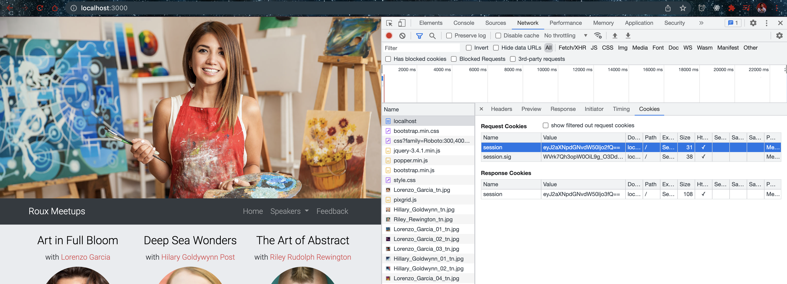
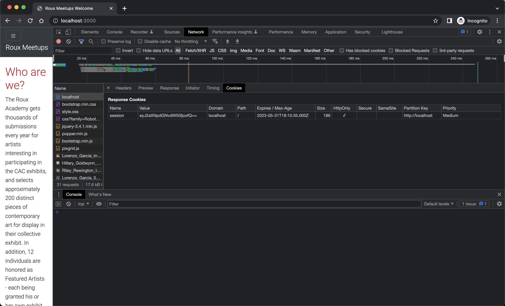

# Add session management middleware

- Install cookie-session

```bash
npm install cookie-session
.
```

- Visit 8th, 9th time in browser




- 1st visit incognito



- 2nd visit incognito


- 3rd visit incognito


- Server side logs

```bash
$ npm run dev

> website@1.0.0 dev
> nodemon --ignore feedback.json server.js

[nodemon] 2.0.22
[nodemon] to restart at any time, enter `rs`
[nodemon] watching path(s): *.*
[nodemon] watching extensions: js,mjs,json
[nodemon] starting `node server.js`
Server is listening on port 3000 Ready to accept requests!
Number of visits: 1
Number of visits: 2
Number of visits: 3
Number of visits: 4
Number of visits: 5
Number of visits: 6
Number of visits: 7
Number of visits: 8
Number of visits: 9
Number of visits: 1
Number of visits: 2
Number of visits: 3
```