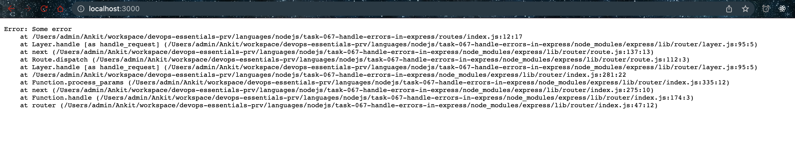

- Running

```bash
$ npm run dev

> task-050-create-express-server@1.0.0 dev
> nodemon --ignore feedback.json server.js

[nodemon] 2.0.15
[nodemon] to restart at any time, enter `rs`
[nodemon] watching path(s): *.*
[nodemon] watching extensions: js,mjs,json
[nodemon] starting `node server.js`
Express server listening on port 3000!
[Object: null prototype] {
  speakerNames: [
    { name: 'Lorenzo Garcia', shortname: 'Lorenzo_Garcia' },
    { name: 'Hilary Goldywynn Post', shortname: 'Hillary_Goldwynn' },
    { name: 'Riley Rudolph Rewington', shortname: 'Riley_Rewington' }
  ]
}
Error: Some error
    at /Users/admin/Ankit/workspace/devops-essentials-prv/languages/nodejs/task-067-handle-errors-in-express/routes/index.js:12:17
    at Layer.handle [as handle_request] (/Users/admin/Ankit/workspace/devops-essentials-prv/languages/nodejs/task-067-handle-errors-in-express/node_modules/express/lib/router/layer.js:95:5)
    at next (/Users/admin/Ankit/workspace/devops-essentials-prv/languages/nodejs/task-067-handle-errors-in-express/node_modules/express/lib/router/route.js:137:13)
    at Route.dispatch (/Users/admin/Ankit/workspace/devops-essentials-prv/languages/nodejs/task-067-handle-errors-in-express/node_modules/express/lib/router/route.js:112:3)
    at Layer.handle [as handle_request] (/Users/admin/Ankit/workspace/devops-essentials-prv/languages/nodejs/task-067-handle-errors-in-express/node_modules/express/lib/router/layer.js:95:5)
    at /Users/admin/Ankit/workspace/devops-essentials-prv/languages/nodejs/task-067-handle-errors-in-express/node_modules/express/lib/router/index.js:281:22
    at Function.process_params (/Users/admin/Ankit/workspace/devops-essentials-prv/languages/nodejs/task-067-handle-errors-in-express/node_modules/express/lib/router/index.js:335:12)
    at next (/Users/admin/Ankit/workspace/devops-essentials-prv/languages/nodejs/task-067-handle-errors-in-express/node_modules/express/lib/router/index.js:275:10)
    at Function.handle (/Users/admin/Ankit/workspace/devops-essentials-prv/languages/nodejs/task-067-handle-errors-in-express/node_modules/express/lib/router/index.js:174:3)
    at router (/Users/admin/Ankit/workspace/devops-essentials-prv/languages/nodejs/task-067-handle-errors-in-express/node_modules/express/lib/router/index.js:47:12)

```


- Error page

