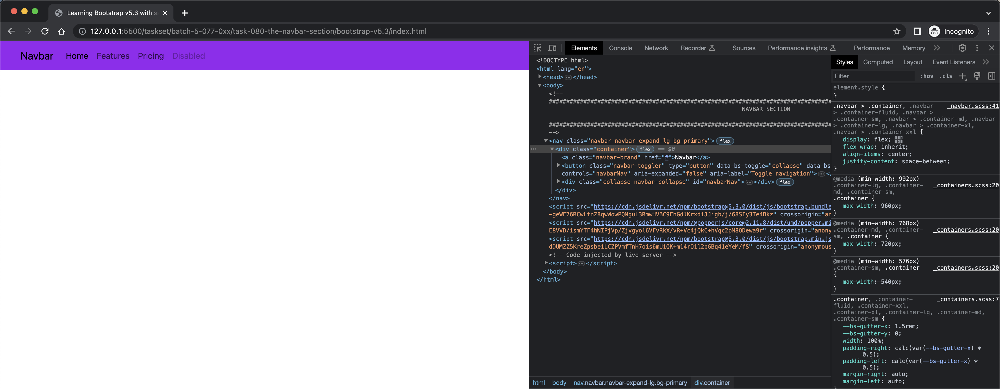
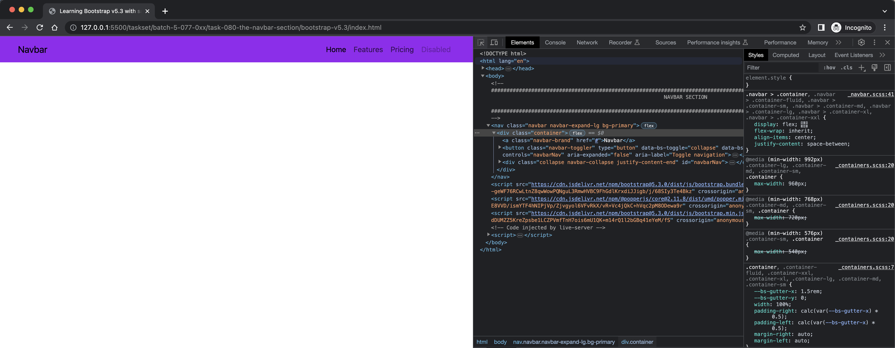
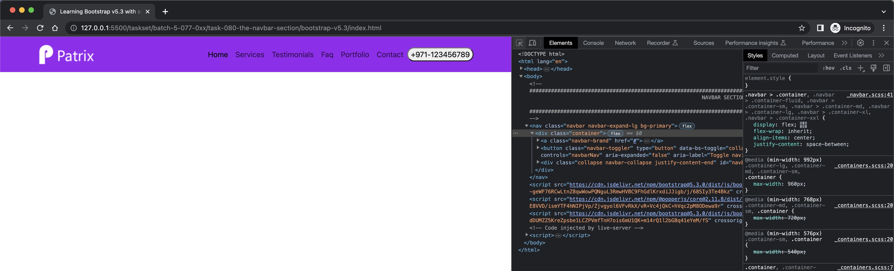
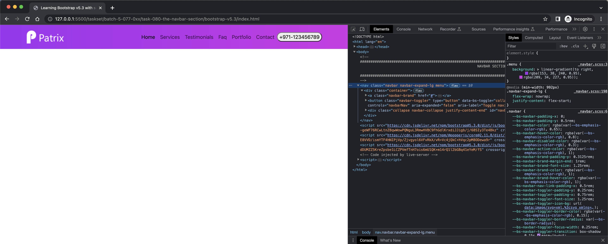
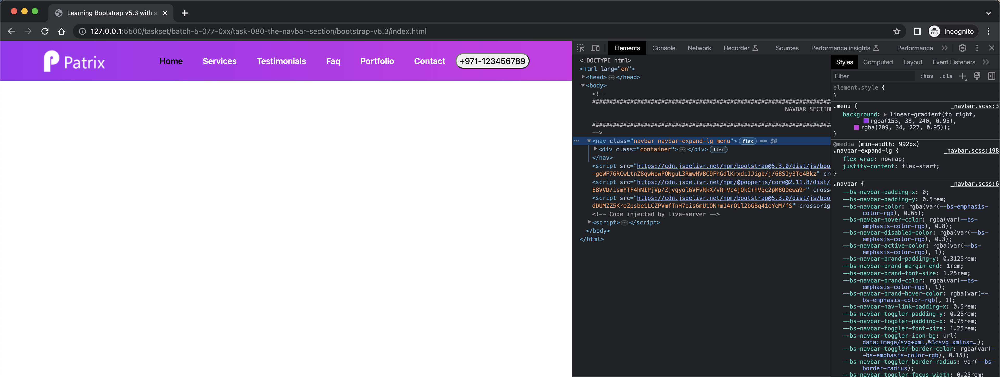
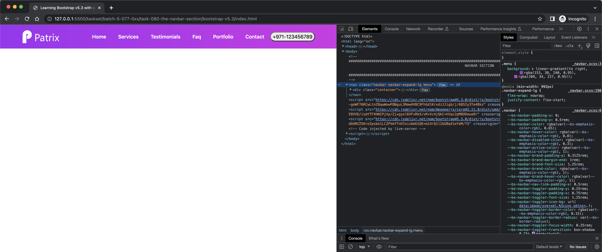
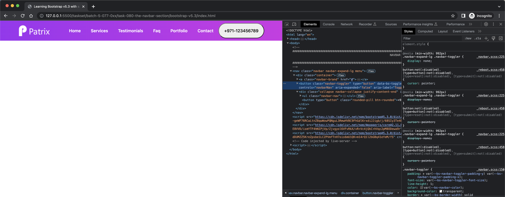
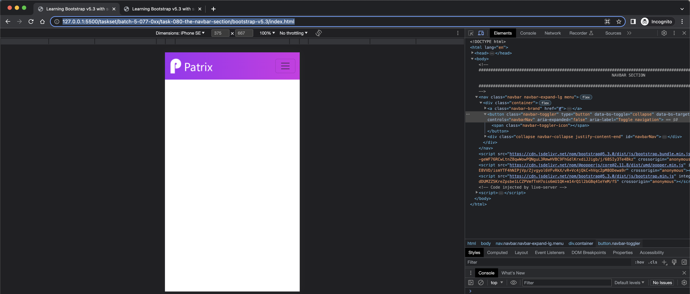
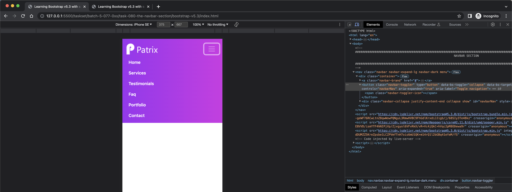
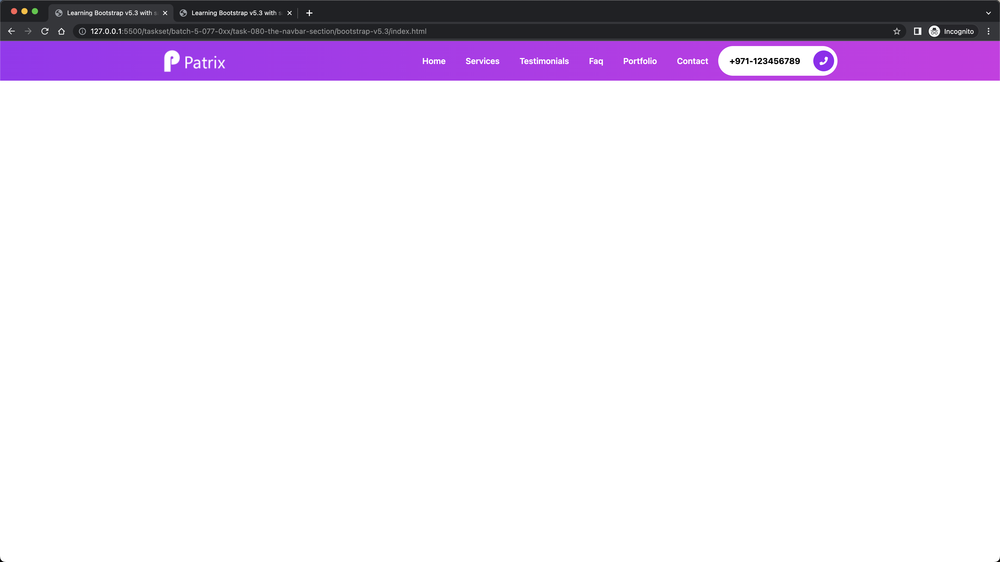

# The Navbar Section

- Version Info

```bash
$ showenv
node: v19.8.0
npm: 9.5.1
yarn: 1.22.19
```

- Create `index.html` file

```bash
$ touch index.html
.
```

- [5.2/getting-started/introduction/](https://getbootstrap.com/docs/5.3/getting-started/introduction/) copy the viewports from here

```html
<!doctype html>
<html lang="en">
  <head>
    <meta charset="utf-8">
    <meta name="viewport" content="width=device-width, initial-scale=1">
    <title>Bootstrap demo</title>
  </head>
  <body>
    <h1>Hello, world!</h1>
  </body>
</html>
```

- also copy the js componenets

```html
    <script src="https://cdn.jsdelivr.net/npm/bootstrap@5.3.0/dist/js/bootstrap.bundle.min.js" integrity="sha384-geWF76RCwLtnZ8qwWowPQNguL3RmwHVBC9FhGdlKrxdiJJigb/j/68SIy3Te4Bkz" crossorigin="anonymous"></script>
    <script src="https://cdn.jsdelivr.net/npm/@popperjs/core@2.11.8/dist/umd/popper.min.js" integrity="sha384-I7E8VVD/ismYTF4hNIPjVp/Zjvgyol6VFvRkX/vR+Vc4jQkC+hVqc2pM8ODewa9r" crossorigin="anonymous"></script>
    <script src="https://cdn.jsdelivr.net/npm/bootstrap@5.3.0/dist/js/bootstrap.min.js" integrity="sha384-fbbOQedDUMZZ5KreZpsbe1LCZPVmfTnH7ois6mU1QK+m14rQ1l2bGBq41eYeM/fS" crossorigin="anonymous"></script> 
```

- Ensure that these are loading fine by opening the `index.html` file in the browser with `live-server`


- Copy the [components/navbar/#nav](https://getbootstrap.com/docs/5.3/components/navbar/#nav)

```html
<nav class="navbar navbar-expand-lg bg-body-tertiary">
  <div class="container-fluid">
    <a class="navbar-brand" href="#">Navbar</a>
    <button class="navbar-toggler" type="button" data-bs-toggle="collapse" data-bs-target="#navbarNav" aria-controls="navbarNav" aria-expanded="false" aria-label="Toggle navigation">
      <span class="navbar-toggler-icon"></span>
    </button>
    <div class="collapse navbar-collapse" id="navbarNav">
      <ul class="navbar-nav">
        <li class="nav-item">
          <a class="nav-link active" aria-current="page" href="#">Home</a>
        </li>
        <li class="nav-item">
          <a class="nav-link" href="#">Features</a>
        </li>
        <li class="nav-item">
          <a class="nav-link" href="#">Pricing</a>
        </li>
        <li class="nav-item">
          <a class="nav-link disabled">Disabled</a>
        </li>
      </ul>
    </div>
  </div>
</nav>
```

- Check in live server


- Change class to `container` instead of `container-fluid`

```html
        <!-- #############################################################################################################
                                                        NAVBAR SECTION 
             ############################################################################################################ -->
        <nav class="navbar navbar-expand-lg bg-body-tertiary">
            <div class="container">
```

- Validate in live server


- Change `bg-body-tertiary` to `bg-primary`

```html
        <!-- #############################################################################################################
                                                        NAVBAR SECTION 
             ############################################################################################################ -->
        <nav class="navbar navbar-expand-lg bg-primary">
            <div class="container">
```



- Justify content by using `justify-content-end` for id `navbarNav`

```html
                <div class="collapse navbar-collapse justify-content-end" id="navbarNav">
```



- Create folder `images` and copy the `logo.png` to it

```bash
$ mkdir images
.
```

- Add logo to the navbar

```html
                <a class="navbar-brand" href="#">
                    
                </a>
```


- Add navbar links and call button

```html
                        <li class="nav-item">
                            <a class="nav-link active" aria-current="page" href="#">Home</a>
                        </li>
                        <li class="nav-item">
                            <a class="nav-link" href="#">Services</a>
                        </li>
                        <li class="nav-item">
                            <a class="nav-link" href="#">Testimonials</a>
                        </li>
                        <li class="nav-item">
                            <a class="nav-link">Faq</a>
                        </li>
                        <li class="nav-item">
                            <a class="nav-link">Portfolio</a>
                        </li>
                        <li class="nav-item">
                            <a class="nav-link">Contact</a>
                        </li>
                    </ul>
                    <button type="button" class="rounded-pill">+971-123456789</button>
```



- Change the `_navbar.scss` file

```scss
@use '../custom' as * ;

.menu {
    background: linear-gradient(to right, rgba($primary,0.95), rgba($secondary, 0.95));
}
```

- Ensure your compilation is running

```bash
$ npm run compile:sass

> task-077@1.0.0 compile:sass
> sass --watch scss:assets/css

Sass is watching for changes. Press Ctrl-C to stop.
```

- Import the new class in navbar

```html
        <!-- #############################################################################################################
                                                        NAVBAR SECTION 
             ############################################################################################################ -->
        <nav class="navbar navbar-expand-lg menu">
```

- Validate in live server



- Add some padding between elements

```scss
.menu {
  ...
      li {
        padding: 0 0.7rem;
    }
  ...
}
```


- Add some styling to \<a\> inside \<li\>

```scss
li {
  ...
        a {
            color: $white;
            text-transform: capitalize;
            font-weight: 600;
        }
  ...
}
```



- Why is `Home` not white?

- Let's make it more importante

```scss
li {
  ...
        a {
            color: $white !important;
            text-transform: capitalize;
            font-weight: 600;
        }
  ...
}
```


- Put gradient in `_mixins.scss`

```scss
@use '../custom' as * ;
@mixin gradient {
    background: linear-gradient(to right, rgba($primary,0.95), rgba($secondary, 0.95));
}
```

- Import the mixin in `_navbar.scss`

```scss
@use '../custom' as * ;
@use '../components/mixins' as * ;
.menu {
    @include gradient;
    ...
}
```



- Start making the button rounded in `_buttons.scss`

```scss
.btn-rounded {
    position: relative;
    padding: 0.9375rem 1.25rem;
    font-weight: 500;
    margin: 0;
}
```

- Use in `index.html`

```html
                       <button type="button" class="rounded-pill btn-rounded">+971-123456789</button>
```



- Let's try adding the phone icon inside the button

```html
  <button type="button" class="rounded-pill btn-rounded">+971-123456789
    <span></span>
  </button>
```

- Add the style in `_buttons.scss`

```scss
.btn-rounded {
    ...
    span {
        position: absolute;
        background-color: $primary;
        width: 2.5rem;
        height: 2.5rem;
    }
    ...
```


- Add more styling

```scss
.btn-rounded {
  ...
    padding: 0.9375rem 4.375rem 0.9375rem 1.25rem;
    border: 0.1rem solid rgba($white, 0.6);
  ...
    span {
        top: 50%;
        right: 5px;
        transform: translateY(-50%);
        border-radius: 50%;
    }
}
```


- Create a file `fontawesome.scss` inside `scss`

```bash
$ touch scss/fontawesome.scss
.
```

- Add the following code

```scss
@use '../node_modules/@fortawesome/fontawesome-free/scss/brands.scss';
@use '../node_modules/@fortawesome/fontawesome-free/scss/regular.scss';
@use '../node_modules/@fortawesome/fontawesome-free/scss/fontawesome.scss';
@use '../node_modules/@fortawesome/fontawesome-free/scss/solid.scss';
```

- Import the file in `index.html` and add the icon

```html
  ...
  <link rel="stylesheet" href="assets/css/fontawesome.css">
  ...
  <span><i class="fas fa-phone-alt"></i></span>
  ...
```

- Find the `webfonts` folder inside `node_modules/@fortawesome/fontawesome-free/` and copy to assets folder

```bash
$ find . -name webfonts       
./node_modules/@fortawesome/fontawesome-free/webfonts
$ cp -rfp ./node_modules/@fortawesome/fontawesome-free/webfonts assets/                                           
.
```

- Now you should be able to see this icon by opening `index.html` in live server


- Now let's try spanning the icon in `_buttons.scss` and add hover effect of gradeint in button and set it's background color to $white

```scss
@use "../components/mixins" as *;
.btn-rounded {
...
      background-color: $white;
...
  span {
    ...
      i {
          color: $white;
          font-size: 1rem;
          line-height: 2.5rem;
      }
    ...
  }

  &:hover {
      @include gradient;
  }

}

```

- Validate changes


- Validate hovereffect


- Add more styling to the button in `_buttons.scss`

```scss
.btn-rounded {
...
    font-weight: 700;
...
    &:hover {
        ...
        span {
            background-color: rgba($black, 0.6);
        }
    }
}
```

- Validate changes in live server


- How does our website look on mobile?



- Let's change the navbar color to $white by adding the class `navbar-dark` in navbar section in `index.html`

```html
        <nav class="navbar navbar-expand-lg navbar-dark menu">
```


- Let's hide the button on small devices, it looks like this right now


- Make changes in `_buttons.scss`

```scss
    @include media-breakpoint-down(sm) {
        display: none;
    }
```

- After hiding



- Final version on desktop


