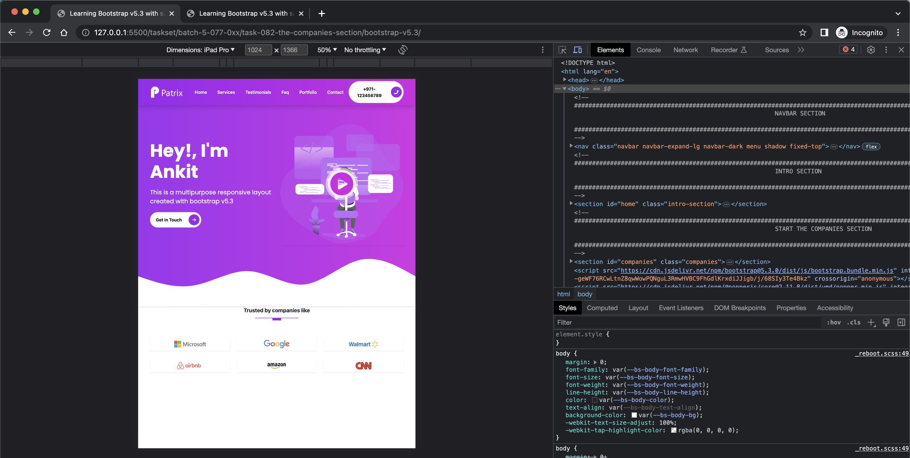

# The Companies Section

- Version Info

```bash
$ showenv
node: v19.8.0
npm: 9.5.1
yarn: 1.22.19
```

- Add 'Trusted by companies like' section. Changes in `index.html`

```html
        <section id="companies" class="companies">
            <div class="container">
                <div class="row text-center">
                    <h4 class="fw-bold lead mb-3">Trusted by companies like</h4>
                </div>
            </div>
        </section>
```

- Validate in live server


- Let's add a line below
- Changes in `_typography.scss`

```scss
.heading-line::before {
    content: ""; // Creates a pseudo-element and sets its content to an empty string.
    width: 10rem; // Sets the width of the pseudo-element to 10rem.
    height: 0.1rem; // Sets the height of the pseudo-element to 0.1rem.
    display: block; // The pseudo-element is displayed as a block element, taking up the full width its parent allows.
    margin: 0 auto; // Centers the pseudo-element horizontally within its parent.
    background-color: $primary; // Sets the background color of the pseudo-element as specified in the $primary variable.
}

.heading-line::after {
    content: ""; // Creates a pseudo-element and sets its content to an empty string.
    width: 2rem; // Sets the width of the pseudo-element to 2rem.
    height: 0.2rem; // Sets the height of the pseudo-element to 0.2rem.
    padding-top: 0.5rem; // Applies a top padding of 0.5rem to the pseudo-element.
    display: block; // The pseudo-element is displayed as a block element, taking up the full width its parent allows.
    margin: 0 auto; // Centers the pseudo-element horizontally within its parent.
    margin-bottom: 1rem; // Applies a bottom margin of 1rem to the pseudo-element.
    background-color: $primary; // Sets the background color of the pseudo-element as specified in the $primary variable.
}
```

- Changes in `index.html`

```html
                    <h4 class="fw-bold lead mb-3">Trusted by companies like</h4>
                    <div class="heading-line"></div>
```


- Adding companies in `index.html`

```html
<!-- START THE COMPANIES -->
<div class="container">
    <div class="row">
        <div class="col-md-4">
            <div class="companies__logo-box">
                
            </div>
        </div>
        <div class="col-md-4">
            <div class="companies__logo-box">
                
            </div>
        </div>
        <div class="col-md-4">
            <div class="companies__logo-box">
                
            </div>
        </div>
        <div class="col-md-4">
            <div class="companies__logo-box">
                
            </div>
        </div>
        <div class="col-md-4">
            <div class="companies__logo-box">
                
            </div>
        </div>
        <div class="col-md-4">
            <div class="companies__logo-box">
                
            </div>
        </div>
    </div>
</div>
```

- Create file `_companies.scss` in `sass/sections` folder

The style you are seeing is called BEM (Block, Element, Modifier) methodology, which is a popular naming convention for classes in HTML and CSS. The goal of BEM is to help developers better understand the relationship between the HTML and CSS in a project.

Here's what BEM stands for:

- `Block` represents an independent entity of your application (e.g., header, container, menu, footer, etc.). In this case, "companies" is your block.
  
- `Element` is a component within the block that performs a particular function. In this case, "__logo-box" is an element within the "companies" block.

- `Modifier` is a variant or extension of the block or element. It is not used in this particular code, but an example would be "menu--hidden" where "--hidden" is a modifier of "menu".

The double underscore in "companies__logo-box" denotes that "logo-box" is an element that resides within the "companies" block.

In the context of a larger application, BEM can make your code more scalable and easier to maintain. It's widely used in larger projects where it's important to manage styles and keep them from conflicting with each other. However, it's not required, and there are other methodologies and conventions you can follow when naming your classes.

```scss
.companies {
    padding: 0 0 5rem 0; // Applies padding of 5rem to the bottom side of the element, with no padding on the top, right, or left.

    &__logo-box {
        max-width: 100%; // Limits the maximum width of the element to 100% of its parent's width.
        height: 3rem; // Sets the height of the element to 3rem.
        margin-bottom: 2rem; // Applies a bottom margin of 2rem to the element.
        padding: 0.5rem; // Applies a padding of 0.5rem to all sides of the element.
        text-align: center; // Centers the text within the element.
        position: relative; // Sets the position of the element to relative, meaning any absolutely positioned children will position relative to this element.
        
        img {
            height: 100%; // Sets the height of any img element within the current element to 100% of its parent's height.
        }
    }
}
```


- Adding shadow effect

```html
<!-- changes in index.html -->
<div class="companies__logo-box shadow-sm">
...
<div class="companies__logo-box shadow-sm">
...
<div class="companies__logo-box shadow-sm">
...
<div class="companies__logo-box shadow-sm">
...
<div class="companies__logo-box shadow-sm">
...
<div class="companies__logo-box shadow-sm">
```

- Also change the svg to following in `index.html`

```html
            <!-- START OF THE WAVES -->
            <svg xmlns="http://www.w3.org/2000/svg" viewBox="0 0 1440 320">
                <path fill="#ffffff" fill-opacity="1"
                    d="M0,160L48,176C96,192,192,224,288,208C384,192,480,128,576,133.3C672,139,768,213,864,202.7C960,192,1056,96,1152,74.7C1248,53,1344,107,1392,133.3L1440,160L1440,320L1392,320C1344,320,1248,320,1152,320C1056,320,960,320,864,320C768,320,672,320,576,320C480,320,384,320,288,320C192,320,96,320,48,320L0,320Z">
                </path>
            </svg>
```


- However in IpadPro, it looks like they can fix in one line,



- So make following changes in `index.html`

```html
<div class="col-md-4 col-lg-2">
.
<div class="col-md-4 col-lg-2">
.
<div class="col-md-4 col-lg-2">
.
<div class="col-md-4 col-lg-2">
.
<div class="col-md-4 col-lg-2">
.
<div class="col-md-4 col-lg-2">
.
<div class="col-md-4 col-lg-2">
.
```


- Adding the hover effect

```scss
...
            &:hover {  // Selecting the hover state of the parent selector.
                filter: grayscale(120); // When an img element is hovered over, applies a grayscale filter with an intensity of 120 (which will be interpreted as 100%).
            }
            ...
```

This block of code changes the visual presentation of an element when a user hovers over it, applying a grayscale filter effect. The `&` refers to the parent selector, and `:hover` is a pseudo-class that targets the hover state of that element. The `filter` property is used for visual effects like blur or changing brightness. In this case, it's used for applying a grayscale effect. The `grayscale()` function converts the element to grayscale, and the parameter `120` specifies the proportion of the conversion, but it's actually beyond the valid range (0-100%), so it will be interpreted as 100%, making the element completely grayscale.

- So now hovering over Google does this


