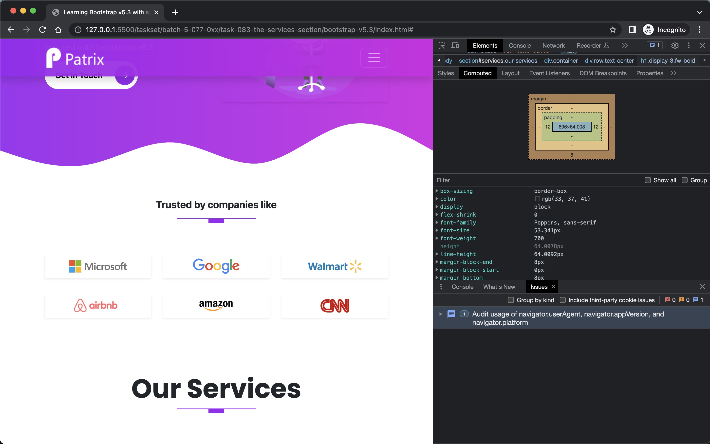
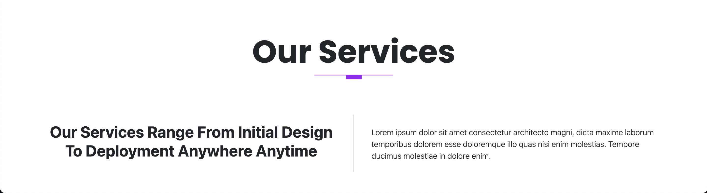
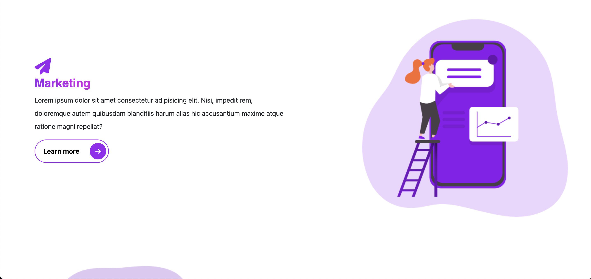
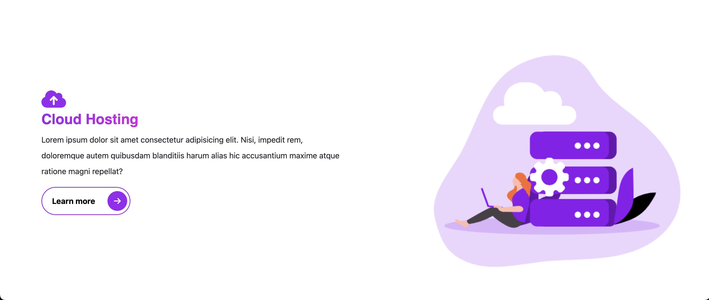
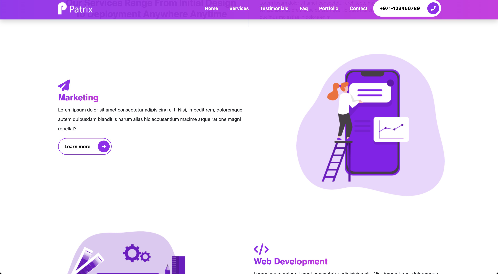
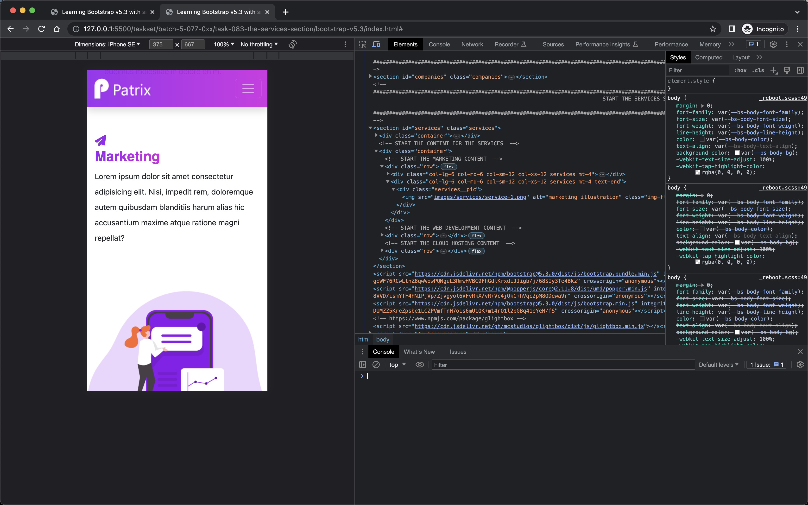

# The Services Section

- Version Info

```bash
$ showenv
node: v19.8.0
npm: 9.5.1
yarn: 1.22.19
```

## Theory

The `&--` and `&__` syntax is used in SCSS/SASS for nesting styles and it comes from the BEM (Block, Element, Modifier) methodology for class naming in CSS. Here's how they work:

1. `&__`: This is typically used to define an "Element" in the BEM terminology. This denotes a part or a child of a "Block". In the SCSS syntax, you append `&__` followed by the element's name. It will be compiled to "block__element" in CSS. 

2. `&--`: This is used to define a "Modifier" in BEM. A "Modifier" represents a different state or version of a "Block" or an "Element". In SCSS, you use `&--` followed by the modifier's name. This will be compiled to "block--modifier" or "block__element--modifier" in CSS.

Now let's go through the provided HTML content and look for examples of how we might apply `&__` and `&--` in SCSS:

1. The top-level div in the navbar has a class of "navbar". This is our "Block". Inside the "navbar", we have elements like "brand" and "nav-item". So, in our SCSS, we might have something like:

    ```scss
    .navbar {
        // Styles for the navbar block
      
        &__brand {
            // Styles for the navbar__brand element
        }
      
        &__nav-item {
            // Styles for the navbar__nav-item element
        }
    }
    ```

2. In the "intro-section" block, we have elements such as "intros", "video-box", and "display-2". We also have modifiers for "display-2" which include "intro" and "description". So, in our SCSS:

    ```scss
    .intro-section {
        &__intros {
            // Styles for intro-section__intros
        }
      
        &__video-box {
            // Styles for intro-section__video-box
        }
      
        &__display-2 {
            // Styles for intro-section__display-2
            
            &--intro {
                // Styles for intro-section__display-2--intro
            }
            
            &--description {
                // Styles for intro-section__display-2--description
            }
        }
    }
    ```

Remember, BEM methodology and this nesting ability in SCSS make your code more scalable and easier to maintain, by avoiding deep nesting and making it clear how classes relate to each other.

- Adding the "Services" Section

- Changes in `index.html`
  
```html
        <section id="services" class="our-services">
            <div class="container">
                <div class="row text-center">
                    <h1 class="display-3 fw-bold">Our Services</h1>
                    <div class="heading-line mb-5"></div>
                </div>
            </div>
        </section>
```

- Changes in `_typography.scss`

```scss
.display-3 {
    font-family: 'Poppins', sans-serif; // Setting the font family to 'Poppins', with sans-serif as the fallback if 'Poppins' is not available.
}
```

- Validate



- Adding Two columns below services with required content and a border

```html
<!-- index.html changes -->
        <section id="services" class="services">
...
                <!-- START THE DESCRIPTION CONTENT  -->
                <div class="row pt-2 pb-2 mt-0 mb-3">
                    <div class="col-md-6 border-right">
                        <div class="bg-white p-3">
                            <h2 class="fw-bold text-capitalize text-center">
                                Our Services Range From Initial Design To Deployment Anywhere Anytime
                            </h2>
                        </div>
                    </div>
                    <div class="col-md-6">
                        <div class="bg-white p-4 text-start">
                            <p class="fw-light">
                                Lorem ipsum dolor sit amet consectetur architecto magni,
                                dicta maxime laborum temporibus dolorem esse doloremque illo quas nisi enim molestias.
                                Tempore ducimus molestiae in dolore enim.
                            </p>
                        </div>
                    </div>
                </div>
...
```

- Changes in `_typography.scss`

```scss
.border-right {
    border-right: 0.1rem solid $gray-300; // Sets the right border of the element to 0.1rem solid $gray-300.
    height: 100%; // Sets the height of the element to 100%.;
}
```



- Add sections for marketing, web-development and cloud hosting

```html
...
             </div>

            <!-- START THE CONTENT FOR THE SERVICES  -->
            <div class="container">
                <!-- START THE MARKETING CONTENT  -->
                <div class="row">
                    <div class="col-lg-6 col-md-6 col-sm-12 col-xs-12 services mt-4">
                        <div class="services__content">
                            <div class="icon d-block fas fa-paper-plane"></div>
                            <h3 class="display-3--title mt-1">Marketing</h3>
                            <p class="lh-lg">
                                Lorem ipsum dolor sit amet consectetur adipisicing elit. Nisi, impedit rem,
                                doloremque autem quibusdam blanditiis harum alias hic accusantium
                                maxime atque ratione magni repellat?
                            </p>
                            <button type="button" class="rounded-pill btn-rounded border-primary">Learn more
                                <span><i class="fas fa-arrow-right"></i></span>
                            </button>
                        </div>
                    </div>
                    <div class="col-lg-6 col-md-6 col-sm-12 col-xs-12 services mt-4 text-end">

                    </div>
                </div>
                <!-- START THE WEB DEVELOPMENT CONTENT  -->
                <div class="row">
                    <div class="col-lg-6 col-md-6 col-sm-12 col-xs-12 services mt-4 text-start">

                    </div>
                    <div class="col-lg-6 col-md-6 col-sm-12 col-xs-12 services mt-4">
                        <div class="services__content">
                            <div class="icon d-block fas fa-code"></div>
                            <h3 class="display-3--title mt-1">web development</h3>
                            <p class="lh-lg">
                                Lorem ipsum dolor sit amet consectetur adipisicing elit. Nisi, impedit rem,
                                doloremque autem quibusdam blanditiis harum alias hic accusantium
                                maxime atque ratione magni repellat?
                            </p>
                            <button type="button" class="rounded-pill btn-rounded border-primary">Learn more
                                <span><i class="fas fa-arrow-right"></i></span>
                            </button>
                        </div>
                    </div>
                </div>
                <!-- START THE CLOUD HOSTING CONTENT  -->
                <div class="row">
                    <div class="col-lg-6 col-md-6 col-sm-12 col-xs-12 services mt-4">
                        <div class="services__content">
                            <div class="icon d-block fas fa-cloud-upload-alt"></div>
                            <h3 class="display-3--title mt-1">cloud hosting</h3>
                            <p class="lh-lg">
                                Lorem ipsum dolor sit amet consectetur adipisicing elit. Nisi, impedit rem,
                                doloremque autem quibusdam blanditiis harum alias hic accusantium
                                maxime atque ratione magni repellat?
                            </p>
                            <button type="button" class="rounded-pill btn-rounded border-primary">Learn more
                                <span><i class="fas fa-arrow-right"></i></span>
                            </button>
                        </div>
                    </div>
                    <div class="col-lg-6 col-md-6 col-sm-12 col-xs-12 services mt-4 text-end">

                    </div>
                </div>
            </div>

         </section>
```


- Let's start adding the images and do some more styling

- Create `_services.scss`

```scss
@use '../custom' as * ; // Import custom SCSS module for usage in this file.

.services {
    position: relative; // Set the positioning context for the services container.
    padding: 1rem 0; // Apply vertical padding.

    &__content {
        padding: 1.5rem; // Apply padding to the content.
        margin-top: 5rem; // Add top margin to the content.
        
        .icon {
            font-size: 2.5rem; // Set the font size for the icons.
            color: $primary; // Set the color for the icons to be the primary color.
        }
    }

    &__pic {
        max-width: 100%; // Ensure the picture doesn't exceed its container width.
    }
}
```

The `&` symbol in SCSS is a parent selector and it refers to the parent selector, which is `.services` in this case. This helps to make the CSS more modular and maintainable. For example, `.services__content` is the result of the `&__content` nested SCSS selector.

- Changes in `_typography.scss`

```scss
     font-family: 'Poppins', sans-serif; // Setting the font family to 'Poppins', with sans-serif as the fallback if 'Poppins' is not available.
...
    &--title {
        font-size: 1.8rem; // Set the font size of the "display-3--title" modifier to 1.8 rem.
        text-transform: capitalize; // Transform the text in "display-3--title" to capitalize each word.
        font-weight: 600; // Set the font weight of the "display-3--title" modifier to 600 (semi-bold).
        font-family: 'Poppins', sans-serif; // Set the font-family of the "display-3--title" modifier to 'Poppins', sans-serif as a fallback.
        display: inline-block; // Set the display property of the "display-3--title" modifier to inline-block.
        background-image: linear-gradient(to right, $primary, $secondary); // Set the background image of the "display-3--title" modifier to a linear gradient, going from left to right, transitioning from the color stored in variable $primary to the color stored in variable $secondary.
        background-clip: text; // Clips the background to the foreground text of the "display-3--title" modifier.
        -webkit-background-clip: text; // Same as above but for WebKit browsers.
        -webkit-text-fill-color: transparent; // Set the text color of "display-3--title" modifier to transparent for WebKit browsers, allowi
ng the background to show through.
    }
...

 ```

- Changes in `index.html`

 ```html
                        <div class="services__pic">
                            
                        </div>
...
                        <div class="services__pic">
                            
                        </div>
...
                        <div class="services__pic">
                            
                        </div>
...
```

- Validate in live server






- Make services section responsive. This is how it looks on Iphone SE now


- Let's decrease this space
  
```html
-                    <div class="heading-line mb-5"></div>
                    <div class="heading-line mb-1"></div>
```


- Make it more responsive across devices, changes in `_services.scss`

```scss
     &__content {        
        padding: 1rem; // Apply padding to the content.
        margin-top: 0rem; // Add top margin to the content.

        @include media-breakpoint-up(lg) {
            margin-top: 5rem; 
        }

         .icon {
            font-size: 1.5rem; // Set the font size for the icons.
             color: $primary; // Set the color for the icons to be the primary color.

            @include media-breakpoint-up(lg) {
                font-size: 2.5rem;  
            }
         }
```

- The icons on smaller devices should be smaller as we set them to 1.5rem by default. Also the margin-top is 0 by default.


- On larger devices, the icons should be bigger and the margin-top should be 5rem.



- Final changes in `_services.scss`

```scss
     &__content {
...
        margin-top: 0rem; // Add top margin to the content. Will be used for smaler devices as we have breakpoints for large devices

        p {
            font-size: 0.8rem; // Set the font size for the paragraph. Will be used for small devices as we have breakpoints for large devices

            @include media-breakpoint-up(lg) {
                font-size: 1rem; // When the viewport is at least 'lg' (large) wide, set the font size for the paragraph to 1rem.
            }
        }
...
         .icon {
            font-size: 1.5rem; // Set the font size for the icons. Will be used for small devices as we have breakpoints for large devices

```

- Changes in `_typography.scss`

```scss
...
        font-size: 1.2rem; // Set the font size of the "display-3--title" modifier to 1.2 rem, will be used for small screens as we have a media query for larger screens.
...
         -webkit-text-fill-color: transparent; // Set the text color of "display-3--title" modifier to transparent for WebKit browsers, allowing the background to show through.

        @include media-breakpoint-up(lg) {
            font-size: 1.8rem; // When the viewport is at least 'lg' (large) wide, increases the font size to 1.8rem.
        }
     }
```


- Smaller devices




