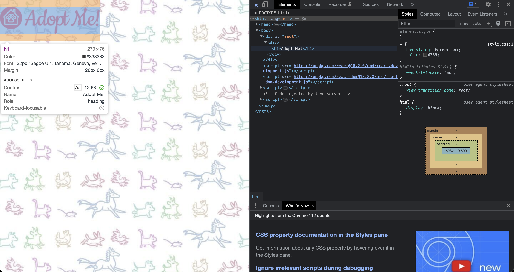

# Pure React And Create Element

- [https://react-v8.holt.courses/lessons/no-frills-react/pure-react](https://react-v8.holt.courses/lessons/no-frills-react/pure-react)

- ENV
  
```bash
$ showenv
node: v19.8.0
npm env: 9.5.1
```

```html
<body>
        <div id="root">rendered</div>
        <script src="https://unpkg.com/react@18.2.0/umd/react.development.js"></script>
        <script src="https://unpkg.com/react-dom@18.2.0/umd/react-dom.development.js"></script>
        <script>
            const App = () => {
                return React.createElement(
                    "div", {},
                    React.createElement("h1", {}, "Adopt Me!")
                );
            };

            const container = document.getElementById("root");
            const root = ReactDOM.createRoot(container);
            root.render(React.createElement(App));
        </script>
    </body>
```

This code snippet is a simple example of a React application rendered in the browser. Let me explain each part of the code:

1. `<div id="root">rendered</div>`: This is a `div` element with an ID of "root", which serves as the root element for the React application. The text "rendered" inside the div will be replaced by the content generated by the React app.

2. `<script src="https://unpkg.com/react@18.2.0/umd/react.development.js"></script>`: This script tag imports the React library from a Content Delivery Network (CDN). It provides the core functionalities required to create and manage React components.

3. `<script src="https://unpkg.com/react-dom@18.2.0/umd/react-dom.development.js"></script>`: This script tag imports the ReactDOM library, which is responsible for rendering React components to the DOM (the web page).

4. The following JavaScript code inside the last `<script>` tag creates and renders a simple React component:

   - `const App = () => { ... }`: This is a functional component named 'App' that returns a React element. It is created using an arrow function. The `React.createElement` function is used to create a `div` element containing an `h1` element with the text "Adopt Me!".

   - `const container = document.getElementById("root");`: This line selects the 'root' element from the DOM using its ID.

   - `const root = ReactDOM.createRoot(container);`: This line creates a new root using the 'container' (the 'root' element) with the help of the `ReactDOM.createRoot()` function. This new root will be used to render the React components.

   - `root.render(React.createElement(App));`: This line renders the 'App' component as a React element by calling `React.createElement(App)`. The rendered component replaces the content of the 'root' element in the DOM. In this case, the text "rendered" inside the div with ID 'root' will be replaced by the content generated by the 'App' component, which is a `div` containing an `h1` element with the text "Adopt Me!".

After the code is executed, the content of the 'root' element will be:

```html
<div>
  <h1>Adopt Me!</h1>
</div>
```

This is a basic example of how to create and render a React component using the React and ReactDOM libraries.


