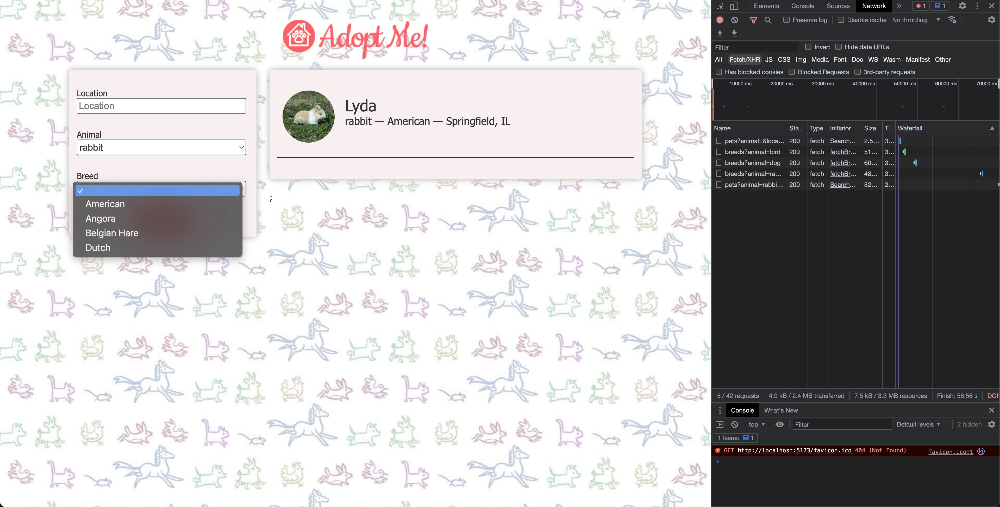

# Refactoring fetchBreedList

- [https://react-v8.holt.courses/lessons/react-capabilities/react-query](https://react-v8.holt.courses/lessons/react-capabilities/react-query)

- ENV
  
```bash
$ showenv
node: v19.8.0
npm env: 9.5.1
```

- Works as expected after change


