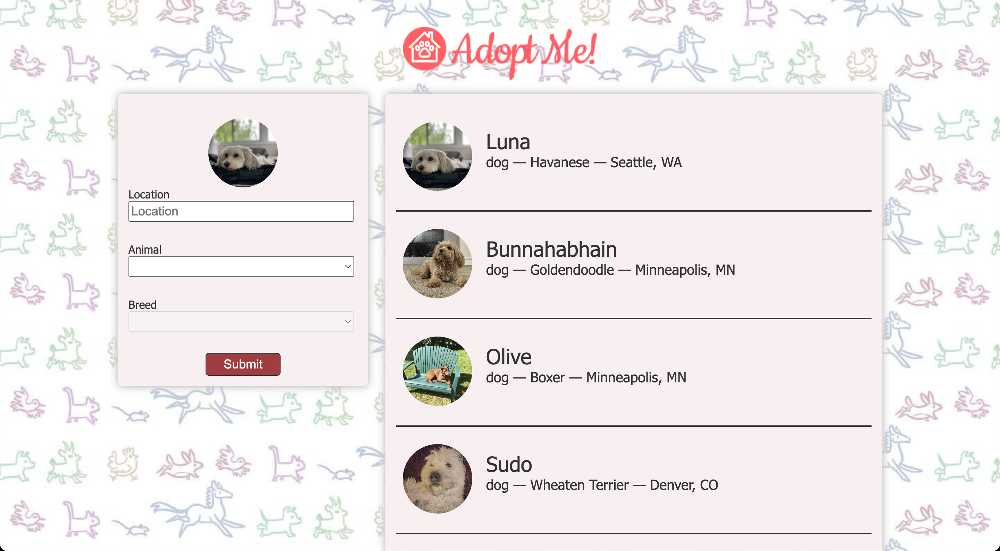
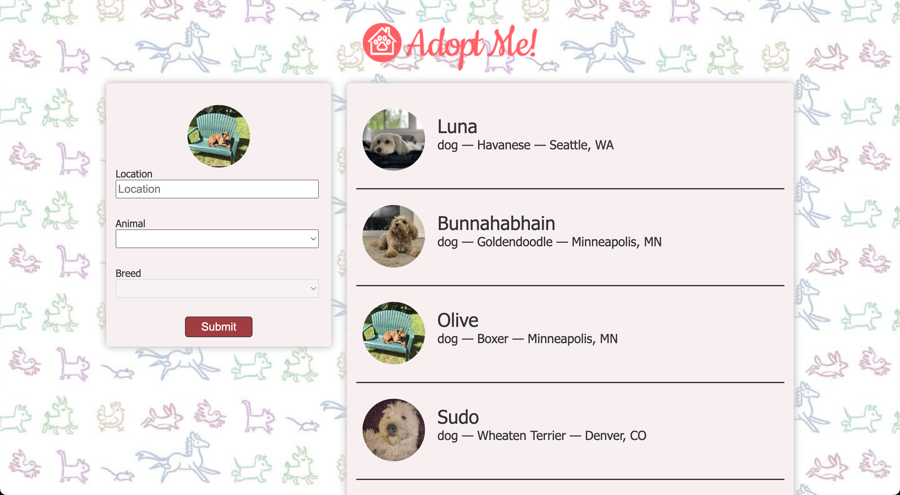

# Context

- [https://react-v8.holt.courses/lessons/special-case-react-tools/context](https://react-v8.holt.courses/lessons/special-case-react-tools/context)

- ENV
  
```bash
$ showenv
node: v19.8.0
npm env: 9.5.1
```

- Homepage



- Click on Olive


- Clicking on Adopt Olive and then click on yes

